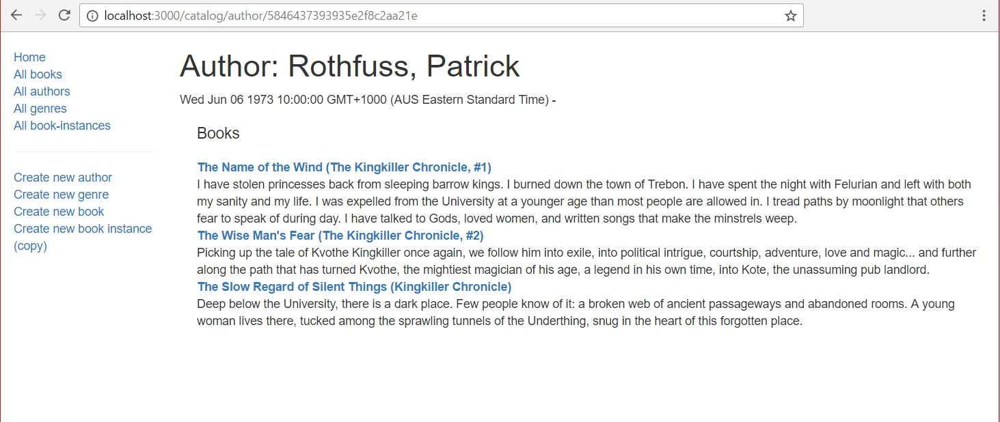

## Buchdetailseite

Die _Buchdetailseite_ muss die Informationen für ein spezifisches `Book` (identifiziert anhand seines automatisch generierten `_id` Feldwertes) zusammen mit Informationen über jede damit verbundene Kopie in der Bibliothek (`BookInstance`) anzeigen. Wo immer wir einen Autor, ein Genre oder eine Buchinstanz anzeigen, sollten diese mit der entsprechenden Detailseite für diesen Artikel verlinkt sein.

## Controller

Öffnen Sie **/controllers/bookController.js**. Finden Sie die exportierte `book_detail()` Controller-Methode und ersetzen Sie sie durch den folgenden Code.

```js
// Detailseite für ein spezifisches Buch anzeigen.
exports.book_detail = asyncHandler(async (req, res, next) => {
  // Details von Büchern, Buchinstanzen für spezifisches Buch abrufen
  const [book, bookInstances] = await Promise.all([
    Book.findById(req.params.id).populate("author").populate("genre").exec(),
    BookInstance.find({ book: req.params.id }).exec(),
  ]);

  if (book === null) {
    // Keine Ergebnisse.
    const err = new Error("Buch nicht gefunden");
    err.status = 404;
    return next(err);
  }

  res.render("book_detail", {
    title: book.title,
    book: book,
    book_instances: bookInstances,
  });
});
```

> **Hinweis:** Wir müssen in diesem Schritt keine zusätzlichen Module anfordern, da wir die Abhängigkeiten bereits beim Implementieren des Startseitencontrollers importiert haben.

Der Ansatz ist genau der gleiche wie für die [Genre-Detailseite](/en-US/docs/Learn/Server-side/Express_Nodejs/Displaying_data/Genre_detail_page) beschrieben.
Die Routen-Controller-Funktion verwendet `Promise.all()`, um das angegebene `Book` und seine zugehörigen Kopien (`BookInstance`) parallel abzufragen.
Wenn kein passendes Buch gefunden wird, wird ein Fehlerobjekt mit einem "404: Nicht gefunden" Fehler zurückgegeben.
Wenn das Buch gefunden wird, werden die abgerufenen Datenbankinformationen mit der Vorlage "book_detail" gerendert.
Da der Schlüssel 'title' verwendet wird, um der Webseite einen Namen zu geben (wie in der Überschrift in 'layout.pug' definiert), übergeben wir dieses Mal `results.book.title` beim Rendern der Webseite.

## Ansicht

Erstellen Sie **/views/book_detail.pug** und fügen Sie den unten stehenden Text hinzu.

```pug
extends layout

block content
  h1 Titel: #{book.title}

  p #[strong Autor:]
    a(href=book.author.url) #{book.author.name}
  p #[strong Zusammenfassung:] #{book.summary}
  p #[strong ISBN:] #{book.isbn}
  p #[strong Genre:]
    each val, index in book.genre
      a(href=val.url) #{val.name}
      if index < book.genre.length - 1
        |,

  div(style='margin-left:20px;margin-top:20px')
    h4 Kopien

    each val in book_instances
      hr
      if val.status=='Available'
        p.text-success #{val.status}
      else if val.status=='Maintenance'
        p.text-danger #{val.status}
      else
        p.text-warning #{val.status}
      p #[strong Imprint:] #{val.imprint}
      if val.status!='Available'
        p #[strong Rückgabedatum:]

 #{val.due_back}
      p #[strong Id:]
        a(href=val.url) #{val._id}

    else
      p Es gibt keine Kopien dieses Buches in der Bibliothek.
```

Fast alles in dieser Vorlage wurde in früheren Abschnitten demonstriert.

> **Hinweis:** Die Liste der mit dem Buch verbundenen Genres wird in der Vorlage wie unten implementiert. Dies fügt nach jedem mit dem Buch verbundenen Genre ein Komma hinzu, mit Ausnahme des letzten.
>
> ```pug
>   p #[strong Genre:]
>     each val, index in book.genre
>       a(href=val.url) #{val.name}
>       if index < book.genre.length - 1
>         |,
> ```

## Wie sieht es aus?

Starten Sie die Anwendung und öffnen Sie Ihren Browser auf `http://localhost:3000/`. Wählen Sie den Link _Alle Bücher_, dann wählen Sie eines der Bücher. Wenn alles korrekt eingerichtet ist, sollte Ihre Seite ungefähr wie der folgende Screenshot aussehen.


# Authorendetails
Die Autorendetailseite muss Informationen über den spezifizierten `Author` anzeigen, identifiziert anhand ihres (automatisch generierten) `_id` Feldwertes, zusammen mit einer Liste aller `Book` Objekte, die mit diesem `Author` verknüpft sind.

## Controller

Öffnen Sie **/controllers/authorController.js**.

Fügen Sie die folgenden Zeilen oben in die Datei ein, um das `Book` Modul zu `require()`ieren, das von der Autorendetailseite benötigt wird (andere Module wie "express-async-handler" sollten bereits vorhanden sein).

```js
const Book = require("../models/book");
```

Finden Sie die exportierte `author_detail()` Controller-Methode und ersetzen Sie sie durch den folgenden Code.

```js
// Detailseite für einen spezifischen Autor anzeigen.
exports.author_detail = asyncHandler(async (req, res, next) => {
  // Details des Autors und all seiner Bücher (parallel) abrufen
  const [author, allBooksByAuthor] = await Promise.all([
    Author.findById(req.params.id).exec(),
    Book.find({ author: req.params.id }, "title summary").exec(),
  ]);

  if (author === null) {
    // Keine Ergebnisse.
    const err = new Error("Autor nicht gefunden");
    err.status = 404;
    return next(err);
  }

  res.render("author_detail", {
    title: "Autor Detail",
    author: author,
    author_books: allBooksByAuthor,
  });
});
```

Der Ansatz ist genau der gleiche wie für die [Genre-Detailseite](/en-US/docs/Learn/Server-side/Express_Nodejs/Displaying_data/Genre_detail_page) beschrieben.
Die Routen-Controller-Funktion verwendet `Promise.all()`, um den angegebenen `Author` und seine zugehörigen `Book` Instanzen parallel abzufragen.
Wenn kein passender Autor gefunden wird, wird ein Fehlerobjekt an die Express-Fehlerbehandlungs-Middleware gesendet.
Wenn der Autor gefunden wird, dann werden die abgerufenen Datenbankinformationen mit der Vorlage "author_detail" gerendert.

## Ansicht

Erstellen Sie **/views/author_detail.pug** und kopieren Sie den folgenden Text hinein.

```pug
extends layout

block content

  h1 Autor: #{author.name}
  p #{author.date_of_birth} - #{author.date_of_death}

  div(style='margin-left:20px;margin-top:20px')

    h4 Bücher

    dl
      each book in author_books
        dt
          a(href=book.url) #{book.title}
        dd #{book.summary}

      else
        p Dieser Autor hat keine Bücher.
```

Alles in dieser Vorlage wurde in früheren Abschnitten demonstriert.

## Wie sieht es aus?

Starten Sie die Anwendung und öffnen Sie Ihren Browser auf `http://localhost:3000/`. Wählen Sie den Link _Alle Autoren_, dann wählen Sie einen der Autoren. Wenn alles korrekt eingerichtet ist, sollte Ihre Seite ungefähr so aussehen wie der folgende Screenshot.



# BookInstance detail page

## Buchexemplar-Detailseite

Die Detailseite für `BookInstance` muss die Informationen für jedes `BookInstance` anzeigen, das anhand seines (automatisch generierten) `_id` Feldwertes identifiziert wird. Dies beinhaltet den Namen des `Book` (als Link zur _Buchdetailseite_) zusammen mit anderen Informationen im Datensatz.

### Controller

Öffnen Sie **/controllers/bookinstanceController.js**.
Finden Sie die exportierte `bookinstance_detail()` Controller-Methode und ersetzen Sie sie durch den folgenden Code.

```js
// Detailseite für ein spezifisches Buchexemplar anzeigen.
exports.bookinstance_detail = asyncHandler(async (req, res, next) => {
  const bookInstance = await BookInstance.findById(req.params.id)
    .populate("book")
    .exec();

  if (bookInstance === null) {
    // Keine Ergebnisse.
    const err = new Error("Buchexemplar nicht gefunden");
    err.status = 404;
    return next(err);
  }

  res.render("bookinstance_detail", {
    title: "Buch:",
    bookinstance: bookInstance,
  });
});
```

Die Implementierung ähnelt sehr stark der, die für die anderen Modell-Detailseiten verwendet wurde.
Die Routen-Controller-Funktion ruft `BookInstance.findById()` mit der ID eines spezifischen Buchexemplars auf, die aus der URL extrahiert wird (mittels der Route) und innerhalb des Controllers über die Anfrageparameter zugänglich ist: `req.params.id`.
Dann ruft es `populate()` auf, um die Details des zugehörigen `Book` zu bekommen.
Wenn kein passendes `BookInstance` gefunden wird, wird ein Fehler an die Express-Middleware gesendet.
Andernfalls werden die zurückgegebenen Daten mit der **bookinstance_detail.pug** Ansicht gerendert.

### Ansicht

Erstellen Sie **/views/bookinstance_detail.pug** und kopieren Sie den unten stehenden Inhalt hinein.

```pug
extends layout

block content

  h1 ID: #{bookinstance._id}

  p #[strong Titel:]
    a(href=bookinstance.book.url) #{bookinstance.book.title}
  p #[strong Druck:] #{bookinstance.imprint}

  p #[strong Status:]
    if bookinstance.status=='Available'
      span.text-success #{bookinstance.status}
    else if bookinstance.status=='Maintenance'
      span.text-danger #{bookinstance.status}
    else
      span.text-warning #{bookinstance.status}

  if bookinstance.status!='Available'
    p #[strong Zurück bis:] #{bookinstance.due_back}
```

Alles in dieser Vorlage wurde in früheren Abschnitten demonstriert.

### Wie sieht es aus?

Starten Sie die Anwendung und öffnen Sie Ihren Browser auf `http://localhost:3000/`. Wählen Sie den Link _Alle Buchexemplare_, dann wählen Sie einen der Einträge. Wenn alles korrekt eingerichtet ist, sollte Ihre Seite etwa so aussehen wie der folgende Screenshot.

