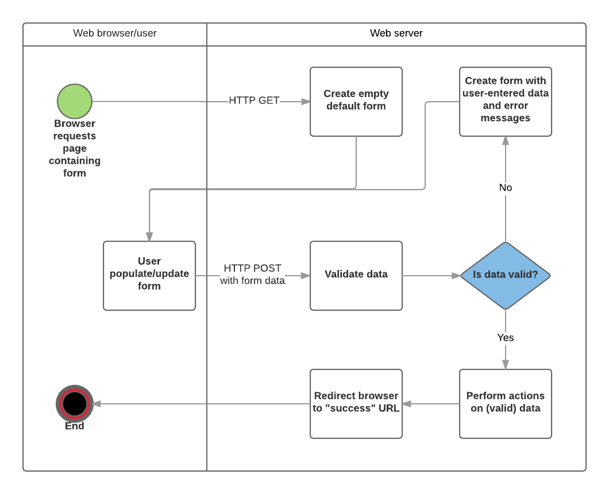

# Arbeiten mit Formularen

In diesem Lernprogramm zeigen wir Ihnen, wie Sie mit HTML-Formularen in Express mit Pug arbeiten können. Insbesondere werden wir besprechen, wie man Formulare zum Erstellen, Aktualisieren und Löschen von Dokumenten in der Datenbank der Website schreibt.

## Überblick

Ein HTML-Formular ist eine Gruppe von einem oder mehreren Feldern/Widgets auf einer Webseite, die verwendet werden können, um Informationen von Benutzern zur Übermittlung an einen Server zu sammeln. Formulare sind ein flexibler Mechanismus für die Erfassung von Benutzereingaben, da es geeignete Formulareingaben für die Eingabe vieler verschiedener Datentypen gibt - Textfelder, Kontrollkästchen, Optionsfelder, Datumsauswahlfelder usw. Formulare sind auch ein relativ sicherer Weg, um Daten mit dem Server auszutauschen, da sie uns erlauben, Daten in POST-Anfragen mit Schutz vor Cross-Site Request Forgery zu senden.

Die Arbeit mit Formularen kann kompliziert sein! Die Entwickler müssen HTML für das Formular schreiben, die eingegebenen Daten auf dem Server (und möglicherweise auch im Browser) validieren und bereinigen, das Formular mit Fehlermeldungen versehen, um die Benutzer über ungültige Felder zu informieren, die Daten verarbeiten, wenn sie erfolgreich übermittelt wurden, und schließlich dem Benutzer auf irgendeine Weise antworten, um den Erfolg anzuzeigen.

In diesem Tutorial werden wir Ihnen zeigen, wie die oben genannten Vorgänge in Express durchgeführt werden können. Dabei werden wir die LocalLibrary-Website so erweitern, dass Benutzer Elemente in der Bibliothek erstellen, bearbeiten und löschen können.

> Hinweis: Wir haben uns noch nicht damit befasst, wie bestimmte Routen auf authentifizierte oder autorisierte Benutzer beschränkt werden können, so dass zu diesem Zeitpunkt jeder Benutzer Änderungen an der Datenbank vornehmen kann.

## HTML Formulare

First a brief overview of HTML Forms. Consider a simple HTML form, with a single text field for entering the name of some "team", and its associated label:


Das Formular ist in HTML als eine Sammlung von Elementen innerhalb der `<form>...</form>`-Tags definiert, die mindestens ein Eingabeelement des Typs `type="submit"` enthalten.

```html
<form action="/team_name_url/" method="post">
  <label for="team_name">Enter name: </label>
  <input
    id="team_name"
    type="text"
    name="name_field"
    value="Default name for team." />
  <input type="submit" value="OK" />
</form>
```

Während wir hier nur ein (Text-)Feld für die Eingabe des Mannschaftsnamens eingefügt haben, kann ein Formular eine beliebige Anzahl von anderen Eingabeelementen und deren zugehörige Beschriftungen enthalten. Das Typ-Attribut des Feldes definiert die Art des Widgets, das angezeigt wird. Name und id des Feldes werden verwendet, um das Feld in JavaScript/CSS/HTML zu identifizieren, während value den Anfangswert für das Feld definiert, wenn es erstmals angezeigt wird. Die passende Teambezeichnung wird mit dem label-Tag angegeben (siehe "Name eingeben" oben), wobei ein for-Feld den id-Wert der zugehörigen Eingabe enthält.

Der Submit-Eingang wird (standardmäßig) als Schaltfläche angezeigt, auf die der Benutzer drücken kann, um die in den anderen Eingabeelementen enthaltenen Daten auf den Server hochzuladen (in diesem Fall nur den Teamnamen). Die Formularattribute definieren die HTTP-Methode, die zum Senden der Daten verwendet wird, und das Ziel der Daten auf dem Server (Aktion):

- Aktion: Die Ressource/URL, an die die Daten zur Verarbeitung gesendet werden sollen, wenn das Formular abgeschickt wird. Wenn dies nicht festgelegt ist (oder auf einen leeren String gesetzt ist), wird das Formular an die aktuelle Seiten-URL zurückgeschickt.

- Methode: Die HTTP-Methode, die zum Senden der Daten verwendet wird: POST oder GET. 

  - Die POST-Methode sollte immer dann verwendet werden, wenn die Daten zu einer Änderung in der Datenbank des Servers führen, da diese Methode widerstandsfähiger gegen Cross-Site-Forgery-Angriffe gemacht werden kann.

  - Die GET-Methode sollte nur für Formulare verwendet werden, die keine Benutzerdaten ändern (z. B. ein Suchformular). Sie wird empfohlen, wenn Sie die URL als Lesezeichen speichern oder weitergeben möchten.

## Prozess der Formularbearbeitung

Bei der Formularverarbeitung kommen die gleichen Techniken zum Einsatz, die wir für die Anzeige von Informationen über unsere Modelle gelernt haben: Die Route sendet unsere Anfrage an eine Controller-Funktion, die alle erforderlichen Datenbankaktionen durchführt, einschließlich des Lesens von Daten aus den Modellen, und dann eine HTML-Seite erzeugt und zurückgibt. Was die Sache komplizierter macht, ist die Tatsache, dass der Server auch in der Lage sein muss, die vom Benutzer bereitgestellten Daten zu verarbeiten und das Formular mit Fehlerinformationen erneut anzuzeigen, wenn es irgendwelche Probleme gibt.

Nachfolgend ist ein Ablaufdiagramm für die Verarbeitung von Formularanfragen dargestellt, beginnend mit einer Anfrage für eine Seite, die ein Formular enthält (grün dargestellt):



Wie im obigen Diagramm dargestellt, muss der Code für die Formularbearbeitung vor allem folgende Aufgaben erfüllen:

1. Anzeige des Standardformulars, wenn es zum ersten Mal vom Benutzer angefordert wird.

  - Das Formular kann leere Felder enthalten (z.B. wenn Sie einen neuen Datensatz erstellen), oder es kann mit Anfangswerten vorausgefüllt sein (z.B. wenn Sie einen Datensatz ändern, oder nützliche Standardanfangswerte haben).

1. Empfangen Sie die vom Benutzer übermittelten Daten, normalerweise in einer HTTP POST-Anfrage.

1. Validieren und bereinigen Sie die Daten.

1. Wenn Daten ungültig sind, zeigen Sie das Formular erneut an - dieses Mal mit allen vom Benutzer eingegebenen Werten und Fehlermeldungen für die Problemfelder.

1. Wenn alle Daten gültig sind, führen Sie die erforderlichen Aktionen durch (z. B. Speichern der Daten in der Datenbank, Senden einer Benachrichtigungs-E-Mail, Rückgabe des Ergebnisses einer Suche, Hochladen einer Datei usw.)

1. Sobald alle Aktionen abgeschlossen sind, leiten Sie den Benutzer auf eine andere Seite weiter.

Häufig wird der Code für die Formularverarbeitung mit einer GET-Route für die anfängliche Anzeige des Formulars und einer POST-Route zum selben Pfad für die Validierung und Verarbeitung der Formulardaten implementiert. Dies ist der Ansatz, der in diesem Tutorial verwendet wird.

Express selbst bietet keine spezielle Unterstützung für die Bearbeitung von Formularen, aber es kann Middleware verwenden, um POST- und GET-Parameter aus dem Formular zu verarbeiten und ihre Werte zu validieren/sanitisieren.

## Validierung und Bereinigung

Bevor die Daten aus einem Formular gespeichert werden, müssen sie validiert und bereinigt werden:

- Bei der Validierung wird geprüft, ob die eingegebenen Werte für jedes Feld geeignet sind (im richtigen Bereich, Format usw.) und ob für alle erforderlichen Felder Werte eingegeben wurden.

- Bei der Bereinigung werden Zeichen in den Daten entfernt/ersetzt, die möglicherweise dazu verwendet werden könnten, bösartige Inhalte an den Server zu senden.

In diesem Tutorial verwenden wir das beliebte Modul express-validator, um sowohl die Validierung als auch die Bereinigung unserer Formulardaten durchzuführen.

### Installation 

Install the module by running the following command in the root of the project.

```bash
npm install express-validator
```

### Nutzen des express-validator

> Hinweis: Der [express-validator-Leitfaden](https://express-validator.github.io/docs/#basic-guide) auf GitHub bietet einen guten Überblick über die API. Wir empfehlen die Lektüre, um eine Vorstellung von all ihren Möglichkeiten zu bekommen (einschließlich der Verwendung von Schema-Validierung und der Erstellung benutzerdefinierter Validatoren). Im Folgenden wird nur eine Teilmenge behandelt, die für die LocalLibrary nützlich ist.

Um den Validator in unseren Controllern zu verwenden, geben wir die speziellen Funktionen an, die wir aus dem express-validator-Modul importieren wollen, wie unten gezeigt:

```javascript
const { body, validationResult } = require("express-validator");
```

Es stehen viele Funktionen zur Verfügung, mit denen Sie Daten aus den Parametern, dem Body, den Headern, den Cookies usw. oder aus allen auf einmal prüfen und bereinigen können. In diesem Tutorial werden wir hauptsächlich body und validationResult (wie oben "erforderlich") verwenden.

Die Funktionen sind wie folgt definiert:

- body([Felder, Nachricht]): Gibt eine Reihe von Feldern im Anforderungskörper (ein POST-Parameter) an, die validiert und/oder bereinigt werden sollen, zusammen mit einer optionalen Fehlermeldung, die angezeigt werden kann, wenn die Tests fehlschlagen. Die Überprüfungs- und Bereinigungskriterien sind mit der Methode body() verkettet. In der folgenden Zeile wird zum Beispiel zunächst definiert, dass das Feld "name" überprüft wird und dass bei einem Überprüfungsfehler die Fehlermeldung "Empty name" angezeigt wird. Dann rufen wir die Bereinigungsmethode trim() auf, um Leerzeichen am Anfang und Ende der Zeichenkette zu entfernen, und anschließend isLength(), um zu prüfen, ob die resultierende Zeichenkette nicht leer ist. Schließlich rufen wir escape() auf, um HTML-Zeichen aus der Variablen zu entfernen, die in JavaScript-Cross-Site-Scripting-Angriffen verwendet werden könnten.

  ```javascript
  [
    // …
    body("name", "Empty name").trim().isLength({ min: 1 }).escape(),
    // …
  ];
  ```

  Dieser Test prüft, ob das Feld "Alter" ein gültiges Datum ist, und verwendet optional(), um festzulegen, dass null und leere Zeichenketten bei der Validierung nicht durchfallen.

  ```javascript
  [
    // …
    body("age", "Invalid age")
      .optional({ values: "falsy" })
      .isISO8601()
      .toDate(),
    // …
  ];
  ```

  Sie können auch verschiedene Prüfer aneinanderreihen und Meldungen hinzufügen, die angezeigt werden, wenn die vorhergehenden Prüfer falsch sind.

  ```javascript
  [
    // …
    body("name")
      .trim()
      .isLength({ min: 1 })
      .withMessage("Name empty.")
      .isAlpha()
      .withMessage("Name must be alphabet letters."),
    // …
  ];
  ```

- validationResult(req): Führt die Validierung durch und stellt die Fehler in Form eines Validierungsergebnisobjekts zur Verfügung. Dies wird, wie unten gezeigt, in einem separaten Callback aufgerufen:

  ```javascript
  asyncHandler(async (req, res, next) => {
    // Extract the validation errors from a request.
    const errors = validationResult(req);

    if (!errors.isEmpty()) {
      // There are errors. Render form again with sanitized values/errors messages.
      // Error messages can be returned in an array using `errors.array()`.
    } else {
      // Data from form is valid.
    }
  });
  ```

  Wir verwenden die isEmpty()-Methode des Validierungsergebnisses, um zu prüfen, ob Fehler aufgetreten sind, und die array()-Methode, um die Menge der Fehlermeldungen zu erhalten. Siehe den Abschnitt Handhabung der Validierung für weitere Informationen.

Die Validierungs- und Bereinigungsketten sind Middleware die an den Express Route Handler übergeben werden sollte (wir tun dies indirekt, über den Controller). Wenn die Middleware läuft, wird jeder Validator/Sanitizer in der angegebenen Reihenfolge ausgeführt.

Wir werden einige echte Beispiele behandeln, wenn wir die LocalLibrary-Formulare weiter unten implementieren.

### Formgestaltung

Viele der Modelle in der Bibliothek sind miteinander verbunden/abhängig - ein Buch erfordert beispielsweise einen Autor und kann auch ein oder mehrere Genres haben. Dies wirft die Frage auf, wie wir mit dem Fall umgehen sollten, dass ein Benutzer dies wünscht:

- Ein Objekt erstellen, wenn die zugehörigen Objekte noch nicht existieren (z. B. ein Buch, für das der Autor noch nicht definiert wurde).

- ein Objekt zu löschen, das noch von einem anderen Objekt verwendet wird (z. B. ein Genre zu löschen, das noch von einem Buch verwendet wird).

Für dieses Projekt werden wir die Implementierung vereinfachen, indem wir angeben, dass ein Formular nur:

- Ein Objekt mit bereits vorhandenen Objekten erstellen (d.h. die Benutzer müssen alle erforderlichen Instanzen von Autor und Genre erstellen, bevor sie versuchen, ein Buchobjekt zu erstellen).

- ein Objekt löschen, wenn es nicht von anderen Objekten referenziert wird (so können Sie zum Beispiel ein Buch erst löschen, wenn alle zugehörigen BookInstance-Objekte gelöscht wurden).

> Hinweis: Eine flexiblere Implementierung könnte es Ihnen ermöglichen, die abhängigen Objekte beim Anlegen eines neuen Objekts zu erstellen und jedes Objekt jederzeit zu löschen (z. B. durch Löschen von abhängigen Objekten oder durch Entfernen von Verweisen auf das gelöschte Objekt aus der Datenbank).

### Routen

Um unseren Code für die Formularverarbeitung zu implementieren, benötigen wir zwei Routen, die das gleiche URL-Muster haben. Die erste Route (GET) wird verwendet, um ein neues leeres Formular für die Erstellung des Objekts anzuzeigen. Die zweite Route (POST) dient zur Validierung der vom Benutzer eingegebenen Daten, zum Speichern der Informationen und zur Weiterleitung auf die Detailseite (wenn die Daten gültig sind) oder zur erneuten Anzeige des Formulars mit Fehlern (wenn die Daten ungültig sind).

Wir haben bereits die Routen für alle Seiten unseres Modells in /routes/catalog.js erstellt (in einem früheren Tutorial). Die Routen für das Genre sind zum Beispiel unten dargestellt:

```javascript
// GET request for creating a Genre. NOTE This must come before route that displays Genre (uses id).
router.get("/genre/create", genre_controller.genre_create_get);

// POST request for creating Genre.
router.post("/genre/create", genre_controller.genre_create_post);
```

## Unterartikel zu Express-Formulare

Die folgenden Unterartikel führen uns durch den Prozess des Hinzufügens der erforderlichen Formulare zu unserer Beispielanwendung. Sie müssen jeden Artikel nacheinander lesen und bearbeiten, bevor Sie mit dem nächsten fortfahren.

# TODO:

- [Definieren einer Seite zum Erstellen von Genre-Objekten](Express-Tutorial-Teil-12.md)
- [Definieren einer Seite zum Erstellen von Autor-Objekten](Express-Tutorial-Teil-13.md)
- [Definieren einer Seite zum Erstellen von Buch-Objekten](Express-Tutorial-Teil-14.md)
- [Definieren einer Seite zum Erstellen von Buchexemplar-Objekten](Express-Tutorial-Teil-15.md)
- [Definieren einer Seite zum Löschen von Autorenobjekten](Express-Tutorial-Teil-16.md)
- [Definieren einer Seite zum Aktualisieren von Buchobjekten](Express-Tutorial-Teil-17.md)

## Fordere dich selbst heraus

Implementieren Sie die Löschseiten für die Modelle Book, BookInstance und Genre, indem Sie sie von den zugehörigen Detailseiten aus auf dieselbe Weise verlinken wie unsere Löschseite für Autoren. Die Seiten sollten dem gleichen Designansatz folgen:

- Wenn es Verweise auf das Objekt von anderen Objekten gibt, dann sollten diese anderen Objekte zusammen mit einem Hinweis angezeigt werden, dass dieser Datensatz nicht gelöscht werden kann, bis die aufgelisteten Objekte gelöscht wurden.

- Wenn es keine anderen Verweise auf das Objekt gibt, sollte die Ansicht zum Löschen auffordern. Wenn der Benutzer auf die Schaltfläche "Löschen" drückt, sollte der Datensatz gelöscht werden.

Ein paar Tipps:

- Das Löschen eines Genres ist genauso wie das Löschen eines Autors, da beide Objekte von einem Buch abhängig sind (in beiden Fällen können Sie das Objekt also nur löschen, wenn die zugehörigen Bücher gelöscht werden).

- Das Löschen eines Buches ist ebenfalls ähnlich, da Sie zuerst prüfen müssen, ob es keine zugehörigen BookInstances gibt.

- Das Löschen einer BookInstance ist am einfachsten, da es keine abhängigen Objekte gibt. In diesem Fall können Sie einfach den zugehörigen Datensatz suchen und ihn löschen.

Implementieren Sie die Aktualisierungsseiten für die Modelle BookInstance, Author und Genre und verknüpfen Sie sie von den zugehörigen Detailseiten aus auf dieselbe Weise wie unsere Aktualisierungsseite für Book.

Ein paar Tipps:

- Die soeben implementierte Buchaktualisierungsseite ist die schwierigste! Die gleichen Muster können für die Aktualisierungsseiten der anderen Objekte verwendet werden.

- Die Felder "Todesdatum des Autors" und "Geburtsdatum" sowie das Feld "Fälligkeitsdatum der BookInstance" haben das falsche Format für die Eingabe in das Datumseingabefeld des Formulars (es erfordert Daten im Format "JJJJ-MM-TT"). Am einfachsten lässt sich dies umgehen, indem Sie eine neue virtuelle Eigenschaft für die Datumsangaben definieren, die die Daten entsprechend formatiert, und dieses Feld dann in den zugehörigen Ansichtsvorlagen verwenden.

- Wenn Sie nicht weiterkommen, finden Sie Beispiele für die Aktualisierungsseiten im Beispiel hier.

## Zusammenfassung

Express, Node und Pakete von Drittanbietern auf npm bieten alles, was Sie brauchen, um Formulare zu Ihrer Website hinzuzufügen. In diesem Artikel haben Sie gelernt, wie Sie Formulare mit Pug erstellen, Eingaben mit express-validator validieren und bereinigen sowie Datensätze in der Datenbank hinzufügen, löschen und ändern können.

Sie sollten nun wissen, wie Sie Ihren eigenen Node-Websites grundlegende Formulare und Code für die Formularverarbeitung hinzufügen können!
