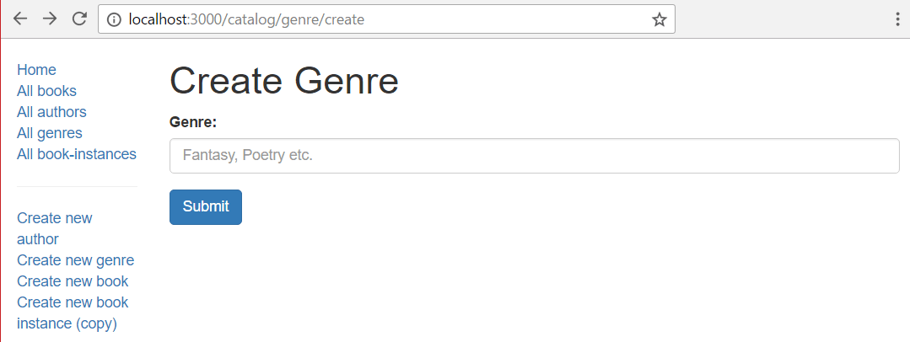
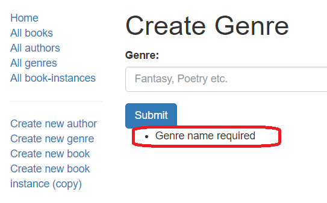

# Genre erstellen Formular

Dieser Unterartikel zeigt, wie wir unsere Seite definieren, um Genre-Objekte zu erstellen (dies ist ein guter Ausgangspunkt, da das Genre nur ein Feld, seinen Namen, und keine Abhängigkeiten hat). Wie bei jeder anderen Seite müssen wir auch hier Routen, Controller und Ansichten einrichten.

## Importiere Validierungs- und Bereinigungsmethoden

Um den Express-Validator in unseren Controllern zu verwenden, müssen wir die Funktionen, die wir verwenden wollen, vom Modul 'express-validator' anfordern.

Öffnen Sie /controllers/genreController.js und fügen Sie die folgende Zeile am Anfang der Datei vor den Routehandlerfunktionen ein:

```javascript
const { body, validationResult } = require("express-validator");
```

> Hinweis: Diese Syntax ermöglicht es uns, body und validationResult als die zugehörigen Middleware-Funktionen zu verwenden, wie Sie im folgenden Abschnitt über die Postroute sehen werden. Sie ist äquivalent zu:
> ```
> const validator = require("express-validator");
> const body = validator.body;
> const validationResult = validator.validationResult;
> ```
>

## Controller—get route

Suchen Sie die exportierte Controller-Methode genre_create_get() und ersetzen Sie sie durch den folgenden Code. Dadurch wird die Ansicht genre_form.pug gerendert und eine Titelvariable übergeben.

```javascript
// Display Genre create form on GET.
exports.genre_create_get = (req, res, next) => {
  res.render("genre_form", { title: "Create Genre" });
};
```

Beachten Sie, dass dies den Platzhalter asynchronous handler, den wir im Express-Tutorial Teil 4: Routen und Controller hinzugefügt haben, durch eine "normale" Express-Routen-Handler-Funktion ersetzt. Wir brauchen den asyncHandler()-Wrapper für diese Route nicht, da sie keinen Code enthält, der eine Ausnahme auslösen kann.

## Controller—post route

Suchen Sie die exportierte Controller-Methode genre_create_post() und ersetzen Sie sie durch den folgenden Code.

```javascript
// Handle Genre create on POST.
exports.genre_create_post = [
  // Validate and sanitize the name field.
  body("name", "Genre name must contain at least 3 characters")
    .trim()
    .isLength({ min: 3 })
    .escape(),

  // Process request after validation and sanitization.
  asyncHandler(async (req, res, next) => {
    // Extract the validation errors from a request.
    const errors = validationResult(req);

    // Create a genre object with escaped and trimmed data.
    const genre = new Genre({ name: req.body.name });

    if (!errors.isEmpty()) {
      // There are errors. Render the form again with sanitized values/error messages.
      res.render("genre_form", {
        title: "Create Genre",
        genre: genre,
        errors: errors.array(),
      });
      return;
    } else {
      // Data from form is valid.
      // Check if Genre with same name already exists.
      const genreExists = await Genre.findOne({ name: req.body.name }).exec();
      if (genreExists) {
        // Genre exists, redirect to its detail page.
        res.redirect(genreExists.url);
      } else {
        await genre.save();
        // New genre saved. Redirect to genre detail page.
        res.redirect(genre.url);
      }
    }
  }),
];
```

Zunächst einmal ist zu beachten, dass der Controller keine einzelne Middleware-Funktion (mit Argumenten (req, res, next)) ist, sondern ein Array von Middleware-Funktionen angibt. Das Array wird an die Router-Funktion übergeben und jede Methode wird der Reihe nach aufgerufen.

> Hinweis: Dieser Ansatz ist erforderlich, weil die Validierer Middleware-Funktionen sind.

Die erste Methode im Array definiert einen Body-Validator (body()), der das Feld validiert und bereinigt. Sie verwendet trim(), um nachlaufende/führende Leerzeichen zu entfernen, prüft, ob das Namensfeld nicht leer ist, und verwendet dann escape(), um gefährliche HTML-Zeichen zu entfernen.

```javascript
[
  // Validate that the name field is not empty.
  body("name", "Genre name must contain at least 3 characters")
    .trim()
    .isLength({ min: 3 })
    .escape(),
  // …
];
```

Nach der Angabe der Validatoren erstellen wir eine Middleware-Funktion, um etwaige Validierungsfehler zu extrahieren. Wir verwenden isEmpty(), um zu prüfen, ob das Validierungsergebnis Fehler enthält. Wenn ja, wird das Formular erneut gerendert, wobei unser bereinigtes Genre-Objekt und das Array der Fehlermeldungen (errors.array()) übergeben werden.

```javascript
// Process request after validation and sanitization.
asyncHandler(async (req, res, next) => {
  // Extract the validation errors from a request.
  const errors = validationResult(req);

  // Create a genre object with escaped and trimmed data.
  const genre = new Genre({ name: req.body.name });

  if (!errors.isEmpty()) {
    // There are errors. Render the form again with sanitized values/error messages.
    res.render("genre_form", {
      title: "Create Genre",
      genre: genre,
      errors: errors.array(),
    });
    return;
  } else {
    // Data from form is valid.
    // …
  }
});
```

Wenn der Genre-Name gültig ist, wird geprüft, ob bereits ein Genre mit demselben Namen existiert (da wir keine Duplikate erstellen wollen). Ist dies der Fall, werden wir auf die Detailseite des bestehenden Genres weitergeleitet. Wenn nicht, speichern wir das neue Genre und leiten zu seiner Detailseite weiter. Beachten Sie, dass wir hier auf das Ergebnis der Datenbankabfrage warten, nach dem gleichen Muster wie in anderen Routing-Handlern.

```javascript
// Check if Genre with same name already exists.
const genreExists = await Genre.findOne({ name: req.body.name }).exec();
if (genreExists) {
  // Genre exists, redirect to its detail page.
  res.redirect(genreExists.url);
} else {
  await genre.save();
  // New genre saved. Redirect to genre detail page.
  res.redirect(genre.url);
}
```

Dasselbe Muster wird in allen unseren Post-Controllern verwendet: Wir führen Validatoren (mit Sanitizern) aus, prüfen dann auf Fehler und geben das Formular entweder mit den Fehlerinformationen neu wieder oder speichern die Daten.

## View

Dieselbe Ansicht wird sowohl in den GET- als auch in den POST-Controllern/-Routen gerendert, wenn wir ein neues Genre erstellen (und später wird sie auch verwendet, wenn wir ein Genre aktualisieren). Im GET-Fall ist das Formular leer, und wir übergeben lediglich eine Titelvariable. Im POST-Fall hat der Benutzer zuvor ungültige Daten eingegeben - in der Genre-Variable wird eine bereinigte Version der eingegebenen Daten zurückgegeben, und in der errors-Variable wird ein Array von Fehlermeldungen zurückgegeben. Der folgende Code zeigt den Controller-Code für das Rendern der Vorlage in beiden Fällen.

```javascript
// Render the GET route
res.render("genre_form", { title: "Create Genre" });

// Render the POST route
res.render("genre_form", {
  title: "Create Genre",
  genre,
  errors: errors.array(),
});
```

Erstellen Sie /views/genre_form.pug und kopieren Sie den unten stehenden Text hinein.

```pug
extends layout

block content
  h1 #{title}

  form(method='POST' action='')
    div.form-group
      label(for='name') Genre:
      input#name.form-control(type='text', placeholder='Fantasy, Poetry etc.' name='name' value=(undefined===genre ? '' : genre.name))
    button.btn.btn-primary(type='submit') Submit

  if errors
   ul
    for error in errors
     li!= error.msg
```

Vieles an dieser Vorlage wird Ihnen aus unseren früheren Tutorials bekannt vorkommen. Zunächst erweitern wir die Basisvorlage layout.pug und überschreiben den Block mit dem Namen "content". Dann haben wir eine Überschrift mit dem Titel, den wir vom Controller übergeben haben (über die Methode render()).

Als Nächstes haben wir den pug-Code für unser HTML-Formular, das method="POST" verwendet, um die Daten an den Server zu senden, und da die Aktion ein leerer String ist, werden die Daten an die gleiche URL wie die Seite gesendet.

Das Formular definiert ein einziges erforderliches Feld vom Typ "Text" mit dem Namen "Name". Der Standardwert des Feldes hängt davon ab, ob die Genre-Variable definiert ist. Wird es über die GET-Route aufgerufen, ist es leer, da es sich um ein neues Formular handelt. Wird es über eine POST-Route aufgerufen, enthält es den ursprünglich vom Benutzer eingegebenen (ungültigen) Wert.

Der letzte Teil der Seite ist der Fehlercode. Hier wird eine Liste von Fehlern gedruckt, wenn die Fehlervariable definiert wurde (mit anderen Worten, dieser Abschnitt wird nicht angezeigt, wenn die Vorlage über die GET-Route gerendert wird).

> Hinweis: Dies ist nur eine Möglichkeit, die Fehler darzustellen. Sie können auch die Namen der betroffenen Felder aus der Fehlervariable abrufen und diese verwenden, um zu steuern, wo die Fehlermeldungen angezeigt werden, ob benutzerdefiniertes CSS angewendet werden soll usw.

## Wie sieht die Anwendung aus?

Führen Sie die Anwendung aus, öffnen Sie Ihren Browser auf http://localhost:3000/ und wählen Sie dann den Link Neues Genre erstellen. Wenn alles korrekt eingerichtet ist, sollte Ihre Seite in etwa so aussehen wie auf dem folgenden Screenshot. Nachdem Sie einen Wert eingegeben haben, sollte dieser gespeichert werden, und Sie werden zur Detailseite des Genres weitergeleitet.



Der einzige Fehler, auf den wir serverseitig prüfen, ist, dass das Feld "Genre" nicht leer sein darf. Der folgende Screenshot zeigt, wie die Fehlerliste aussehen würde, wenn Sie kein Genre angeben würden (rot hervorgehoben).



> Note: Our validation uses trim() to ensure that whitespace is not accepted as a genre name. We can also validate that the field is not empty on the client side by adding the value required='true' to the field definition in the form:

> ```javascript
> input#name.form-control(type='text', placeholder='Fantasy, Poetry etc.' name='name' value=(undefined===genre ? '' : genre.name), required='true' )
> ```
>
