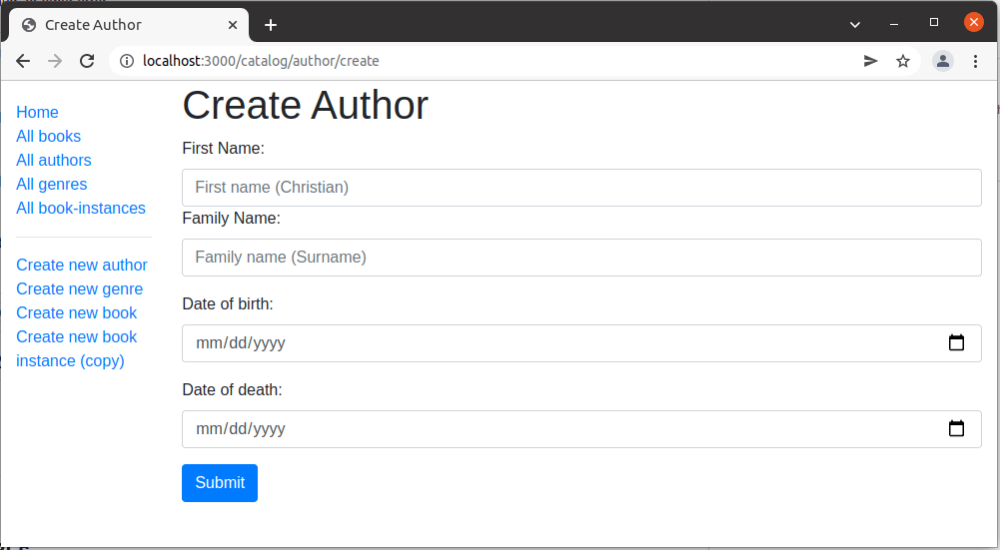

# Author erstellen Formular

Dieser Unterartikel zeigt, wie man eine Seite für die Erstellung von Autorenobjekten definiert.

## Importiere Validierungs- und Bereinigungsmethoden

Wie beim Genre-Formular müssen wir auch für die Verwendung von express-validator die Funktionen, die wir verwenden wollen, angeben.

Öffnen Sie /controllers/authorController.js und fügen Sie die folgende Zeile am Anfang der Datei ein (oberhalb der Routenfunktionen):

```javascript
const { body, validationResult } = require("express-validator");
```

## Controller—get route

Suchen Sie die exportierte Controller-Methode author_create_get() und ersetzen Sie sie durch den folgenden Code. Dadurch wird die Ansicht author_form.pug gerendert und eine Titelvariable übergeben.

```javascript
// Display Author create form on GET.
exports.author_create_get = (req, res, next) => {
  res.render("author_form", { title: "Create Author" });
};
```

## Controller—post route

Suchen Sie die exportierte Controller-Methode author_create_post() und ersetzen Sie sie durch den folgenden Code.

```javascript
// Handle Author create on POST.
exports.author_create_post = [
  // Validate and sanitize fields.
  body("first_name")
    .trim()
    .isLength({ min: 1 })
    .escape()
    .withMessage("First name must be specified.")
    .isAlphanumeric()
    .withMessage("First name has non-alphanumeric characters."),
  body("family_name")
    .trim()
    .isLength({ min: 1 })
    .escape()
    .withMessage("Family name must be specified.")
    .isAlphanumeric()
    .withMessage("Family name has non-alphanumeric characters."),
  body("date_of_birth", "Invalid date of birth")
    .optional({ values: "falsy" })
    .isISO8601()
    .toDate(),
  body("date_of_death", "Invalid date of death")
    .optional({ values: "falsy" })
    .isISO8601()
    .toDate(),

  // Process request after validation and sanitization.
  asyncHandler(async (req, res, next) => {
    // Extract the validation errors from a request.
    const errors = validationResult(req);

    // Create Author object with escaped and trimmed data
    const author = new Author({
      first_name: req.body.first_name,
      family_name: req.body.family_name,
      date_of_birth: req.body.date_of_birth,
      date_of_death: req.body.date_of_death,
    });

    if (!errors.isEmpty()) {
      // There are errors. Render form again with sanitized values/errors messages.
      res.render("author_form", {
        title: "Create Author",
        author: author,
        errors: errors.array(),
      });
      return;
    } else {
      // Data from form is valid.

      // Save author.
      await author.save();
      // Redirect to new author record.
      res.redirect(author.url);
    }
  }),
];
```

> Warnung: Überprüfen Sie Namen niemals mit isAlphanumeric() (wie wir es oben getan haben), da es viele Namen gibt, die andere Zeichensätze verwenden. Wir tun es hier, um zu demonstrieren, wie der Validator verwendet wird und wie er mit anderen Validatoren und Fehlerberichten verkettet werden kann.

Die Struktur und das Verhalten dieses Codes entspricht fast genau dem der Erstellung eines Genre-Objekts. Zunächst werden die Daten validiert und bereinigt. Wenn die Daten ungültig sind, wird das Formular mit den ursprünglich vom Benutzer eingegebenen Daten und einer Liste von Fehlermeldungen erneut angezeigt. Wenn die Daten gültig sind, speichern wir den neuen Autorendatensatz und leiten den Benutzer zur Autorendetailseite weiter.

Anders als beim Genre post handler wird nicht geprüft, ob das Author-Objekt bereits existiert, bevor es gespeichert wird. Das ist auch gut so, denn so wie es jetzt ist, können wir mehrere Autoren mit demselben Namen haben.

Der Validierungscode demonstriert mehrere neue Funktionen:

- Wir können Validatoren in Reihe schalten, indem wir mitMessage() die Fehlermeldung angeben, die angezeigt werden soll, wenn die vorherige Validierungsmethode fehlschlägt. Dies macht es sehr einfach, spezifische Fehlermeldungen ohne viel Code-Duplikation bereitzustellen.
  
  ```javascript
  [
    // Validate and sanitize fields.
    body("first_name")
      .trim()
      .isLength({ min: 1 })
      .escape()
      .withMessage("First name must be specified.")
      .isAlphanumeric()
      .withMessage("First name has non-alphanumeric characters."),
    // …
  ];
  ```

- We can use the optional() function to run a subsequent validation only if a field has been entered (this allows us to validate optional fields). For example, below we check that the optional date of birth is an ISO8601-compliant date (the { values: "falsy" } object passed means that we'll accept either an empty string or null as an empty value).

  ```javascript
  [
    body("date_of_birth", "Invalid date of birth")
      .optional({ values: "falsy" })
      .isISO8601()
      .toDate(),
  ];
  ```

- Die Parameter werden von der Anfrage als Strings empfangen. Mit toDate() (oder toBoolean()) können diese in die richtigen JavaScript-Typen umgewandelt werden (wie am Ende der Validierungskette oben gezeigt).

## View

Erstellen Sie /views/author_form.pug und kopieren Sie den unten stehenden Text hinein.

```pug
extends layout

block content
  h1=title

  form(method='POST' action='')
    div.form-group
      label(for='first_name') First Name:
      input#first_name.form-control(type='text' placeholder='First name' name='first_name' required='true' value=(undefined===author ? '' : author.first_name) )
      label(for='family_name') Family Name:
      input#family_name.form-control(type='text' placeholder='Family name' name='family_name' required='true' value=(undefined===author ? '' : author.family_name))
    div.form-group
      label(for='date_of_birth') Date of birth:
      input#date_of_birth.form-control(type='date' name='date_of_birth' value=(undefined===author ? '' : author.date_of_birth) )
    button.btn.btn-primary(type='submit') Submit
  if errors
    ul
      for error in errors
        li!= error.msg
```

Die Struktur und das Verhalten dieser Ansicht sind genau dieselben wie bei der Vorlage genre_form.pug, so dass wir sie nicht noch einmal beschreiben werden.

> Hinweis: Einige Browser unterstützen den input type="date" nicht, so dass Sie weder das Datumsauswahl-Widget noch den Standardplatzhalter dd/mm/yyyy erhalten, sondern stattdessen ein leeres Textfeld. Ein Workaround ist das explizite Hinzufügen des Attributs placeholder='dd/mm/yyyy', so dass Sie auf weniger leistungsfähigen Browsern trotzdem Informationen über das gewünschte Textformat erhalten.

### Herausforderung: Hinzufügen des Todesdatums

In der obigen Vorlage fehlt ein Feld für die Eingabe des Sterbedatums. Erstellen Sie das Feld nach demselben Muster wie die Formulargruppe für das Geburtsdatum!

## Wie sieht es aus? 

Führen Sie die Anwendung aus, öffnen Sie Ihren Browser auf http://localhost:3000/ und wählen Sie dann den Link Neuen Autor erstellen. Wenn alles korrekt eingerichtet ist, sollte Ihre Seite in etwa so aussehen wie auf dem folgenden Screenshot. Nachdem Sie einen Wert eingegeben haben, sollte dieser gespeichert werden und Sie werden zur Autorendetailseite weitergeleitet.



> Hinweis: Wenn Sie mit verschiedenen Eingabeformaten für das Datum experimentieren, werden Sie feststellen, dass das Format yyyy-mm-dd nicht funktioniert. Das liegt daran, dass JavaScript Datumszeichenfolgen so behandelt, als enthielten sie die Zeit von 0 Stunden, aber zusätzlich Datumszeichenfolgen in diesem Format (dem ISO 8601-Standard) so behandelt, als enthielten sie die Zeit 0 Stunden UTC und nicht die Ortszeit. Wenn Ihre Zeitzone westlich von UTC liegt, wird das Datum in lokaler Zeit einen Tag vor dem eingegebenen Datum angezeigt. Dies ist eine von mehreren Komplexitäten (wie z. B. Familiennamen mit mehreren Wörtern und Bücher mit mehreren Autoren), auf die wir hier nicht eingehen.
