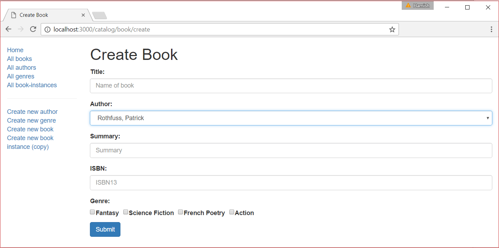

# Buch erstellen Formular

In diesem Unterartikel wird gezeigt, wie man eine Seite/ein Formular zum Erstellen von Buchobjekten definiert. Dies ist etwas komplizierter als die entsprechenden Seiten für Autoren oder Genres, da wir die verfügbaren Datensätze für Autoren und Genres in unserem Buchformular abrufen und anzeigen müssen.

## Importiere Validierungs- und Bereinigungsmethoden

Öffnen Sie /controllers/bookController.js, und fügen Sie die folgende Zeile am Anfang der Datei ein (vor den Routenfunktionen):

```javascript
const { body, validationResult } = require("express-validator");
```

## Controller—get route

Suchen Sie die exportierte Controller-Methode book_create_get() und ersetzen Sie sie durch den folgenden Code:

```javascript
// Display book create form on GET.
exports.book_create_get = asyncHandler(async (req, res, next) => {
  // Get all authors and genres, which we can use for adding to our book.
  const [allAuthors, allGenres] = await Promise.all([
    Author.find().exec(),
    Genre.find().exec(),
  ]);

  res.render("book_form", {
    title: "Create Book",
    authors: allAuthors,
    genres: allGenres,
  });
});
```

Dies verwendet await auf das Ergebnis von Promise.all(), um alle Author- und Genre-Objekte parallel zu erhalten (der gleiche Ansatz, der im Express-Tutorial Teil 5: Anzeigen von Bibliotheksdaten verwendet wird). Diese werden dann an die Ansicht book_form.pug als Variablen mit den Namen authors und genres (zusammen mit dem Seitentitel) übergeben.

## Controller—post route

Suchen Sie die exportierte Controller-Methode book_create_post() und ersetzen Sie sie durch den folgenden Code.

```javascript
// Handle book create on POST.
exports.book_create_post = [
  // Convert the genre to an array.
  (req, res, next) => {
    if (!(req.body.genre instanceof Array)) {
      if (typeof req.body.genre === "undefined") req.body.genre = [];
      else req.body.genre = new Array(req.body.genre);
    }
    next();
  },

  // Validate and sanitize fields.
  body("title", "Title must not be empty.")
    .trim()
    .isLength({ min: 1 })
    .escape(),
  body("author", "Author must not be empty.")
    .trim()
    .isLength({ min: 1 })
    .escape(),
  body("summary", "Summary must not be empty.")
    .trim()
    .isLength({ min: 1 })
    .escape(),
  body("isbn", "ISBN must not be empty").trim().isLength({ min: 1 }).escape(),
  body("genre.*").escape(),
  // Process request after validation and sanitization.

  asyncHandler(async (req, res, next) => {
    // Extract the validation errors from a request.
    const errors = validationResult(req);

    // Create a Book object with escaped and trimmed data.
    const book = new Book({
      title: req.body.title,
      author: req.body.author,
      summary: req.body.summary,
      isbn: req.body.isbn,
      genre: req.body.genre,
    });

    if (!errors.isEmpty()) {
      // There are errors. Render form again with sanitized values/error messages.

      // Get all authors and genres for form.
      const [allAuthors, allGenres] = await Promise.all([
        Author.find().exec(),
        Genre.find().exec(),
      ]);

      // Mark our selected genres as checked.
      for (const genre of allGenres) {
        if (book.genre.indexOf(genre._id) > -1) {
          genre.checked = "true";
        }
      }
      res.render("book_form", {
        title: "Create Book",
        authors: allAuthors,
        genres: allGenres,
        book: book,
        errors: errors.array(),
      });
    } else {
      // Data from form is valid. Save book.
      await book.save();
      res.redirect(book.url);
    }
  }),
];
```

Die Struktur und das Verhalten dieses Codes entsprechen fast genau den Post-Route-Funktionen für die Formulare Genre und Autor. Zunächst werden die Daten validiert und bereinigt. Wenn die Daten ungültig sind, wird das Formular mit den ursprünglich vom Benutzer eingegebenen Daten und einer Liste von Fehlermeldungen erneut angezeigt. Wenn die Daten gültig sind, speichern wir den neuen Buchdatensatz und leiten den Benutzer auf die Buchdetailseite weiter.

Der Hauptunterschied zum anderen Code für die Formularverarbeitung besteht darin, wie wir die Genre-Informationen bereinigen. Das Formular gibt ein Array von Genre-Elementen zurück (während es für andere Felder einen String zurückgibt). Um die Informationen zu validieren, wandeln wir die Anfrage zunächst in ein Array um (erforderlich für den nächsten Schritt).

```javascript
[
  // Convert the genre to an array.
  (req, res, next) => {
    if (!Array.isArray(req.body.genre)) {
      req.body.genre =
        typeof req.body.genre === "undefined" ? [] : [req.body.genre];
    }
    next();
  },
  // …
];
```

Wir verwenden dann einen Platzhalter (*) in der Bereinigungsfunktion, um jeden der Einträge im Genre-Array einzeln zu überprüfen. Der nachstehende Code zeigt, wie das geht - das bedeutet "jedes Element unter dem Schlüssel Genre bereinigen".

```javascript
[
  // …
  body("genre.*").escape(),
  // …
];
```

Der letzte Unterschied zum anderen Code für die Formularbearbeitung besteht darin, dass wir alle vorhandenen Genres und Autoren an das Formular übergeben müssen. Um die Genres zu markieren, die vom Benutzer angekreuzt wurden, durchlaufen wir alle Genres und fügen den Parameter checked='true' zu denjenigen hinzu, die in unseren Beitragsdaten enthalten sind (wie im folgenden Codefragment dargestellt).

```javascript
// Mark our selected genres as checked.
for (const genre of results.genres) {
  if (book.genre.includes(genre._id)) {
    // Current genre is selected. Set "checked" flag.
    genre.checked = "true";
  }
}
```

## Ansicht

Erstellen Sie /views/book_form.pug und kopieren Sie den unten stehenden Text hinein.

```pug
extends layout

block content
  h1= title

  form(method='POST' action='')
    div.form-group
      label(for='title') Title:
      input#title.form-control(type='text', placeholder='Name of book' name='title' required='true' value=(undefined===book ? '' : book.title) )
    div.form-group
      label(for='author') Author:
      select#author.form-control(type='select', placeholder='Select author' name='author' required='true' )
        - authors.sort(function(a, b) {let textA = a.family_name.toUpperCase(); let textB = b.family_name.toUpperCase(); return (textA < textB) ? -1 : (textA > textB) ? 1 : 0;});
        for author in authors
          if book
            option(value=author._id selected=(author._id.toString()===book.author._id.toString() ? 'selected' : false) ) #{author.name}
          else
            option(value=author._id) #{author.name}
    div.form-group
      label(for='summary') Summary:
      textarea#summary.form-control(type='textarea', placeholder='Summary' name='summary' required='true') #{undefined===book ? '' : book.summary}
    div.form-group
      label(for='isbn') ISBN:
      input#isbn.form-control(type='text', placeholder='ISBN13' name='isbn' value=(undefined===book ? '' : book.isbn) required='true')
    div.form-group
      label Genre:
      div
        for genre in genres
          div(style='display: inline; padding-right:10px;')
            input.checkbox-input(type='checkbox', name='genre', id=genre._id, value=genre._id, checked=genre.checked )
            label(for=genre._id) #{genre.name}
    button.btn.btn-primary(type='submit') Submit

  if errors
    ul
      for error in errors
        li!= error.msg
```

Die Struktur und das Verhalten der Ansicht ist fast identisch mit der Vorlage genre_form.pug.

Die Hauptunterschiede liegen in der Implementierung der Felder vom Typ Auswahl: Autor und Genre.

- Die Genres werden als Kontrollkästchen angezeigt und verwenden den Wert "checked", den wir im Controller festgelegt haben, um zu bestimmen, ob das Feld ausgewählt werden soll oder nicht.
- Die Autoren werden als alphabetisch geordnete Dropdown-Liste mit einer Auswahl angezeigt. Wenn der Benutzer zuvor einen Buchautor ausgewählt hat (z. B. beim Korrigieren ungültiger Feldwerte nach dem ersten Absenden des Formulars oder beim Aktualisieren von Buchdetails), wird der Autor erneut ausgewählt, wenn das Formular angezeigt wird. Hier wird der auszuwählende Autor bestimmt, indem die ID der aktuellen Autorenoption mit dem zuvor vom Benutzer eingegebenen Wert verglichen wird (der über die Buchvariable übergeben wird).
- Die Autoren werden alphabetisch geordnet, bevor sie als Optionen in die Dropdown-Liste aufgenommen werden:

  ```pug
  - authors.sort(function(a, b) {let textA = a.family_name.toUpperCase(); let textB = b.family_name.toUpperCase(); return (textA < textB) ? -1 : (textA > textB) ? 1 : 0;});
  ```

Note that the code starts with -. In pug this is referred to as "unbuffered code", and doesn't add anything to the view (see pug docs for more detail).

> Hinweis: Wenn im übermittelten Formular ein Fehler auftritt, sind die Kennung des neuen Buchautors und die Kennung der Autoren der vorhandenen Bücher vom Typ Schema.Types.ObjectId, wenn das Formular neu gerendert werden soll. Um sie zu vergleichen, müssen wir sie also zunächst in Strings umwandeln.

## Wie sieht es aus? 

Run the application, open your browser to http://localhost:3000/, then select the Create new book link. If everything is set up correctly, your site should look something like the following screenshot. After you submit a valid book, it should be saved and you'll be taken to the book detail page.


