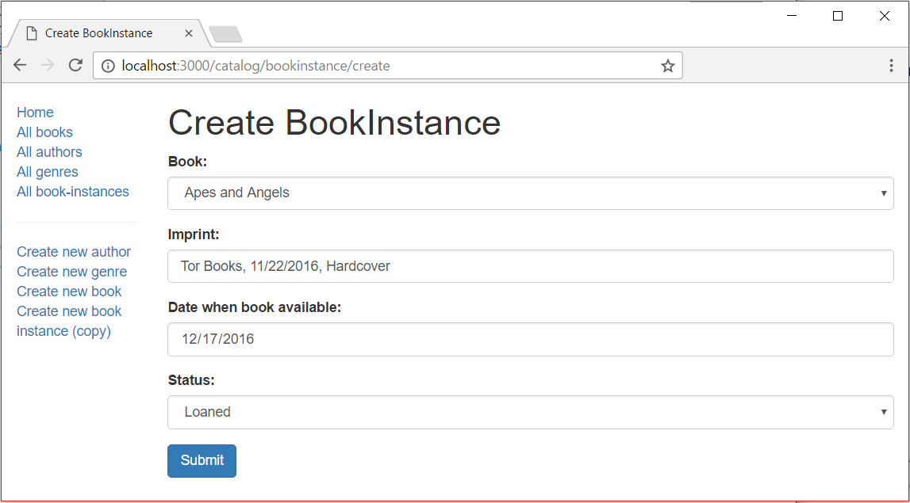

# Buchexemplar erstellen Formular

In diesem Unterartikel wird gezeigt, wie man eine Seite/ein Formular zum Erstellen von BookInstance-Objekten definiert. Dies ähnelt sehr dem Formular, das wir zum Erstellen von Book-Objekten verwendet haben.

## Importiere Validierungs- und Bereinigungsmethoden

Öffnen Sie /controllers/bookinstanceController.js, und fügen Sie die folgende Zeile am Anfang der Datei ein (vor den Routenfunktionen):

```javascript
const { body, validationResult } = require("express-validator");
```

## Controller—get route

Am Anfang der Datei ist das Modul Book erforderlich (da jede BookInstance mit einem bestimmten Book verbunden ist).

```javascript
const Book = require("../models/book");
```

Suchen Sie die exportierte Controller-Methode bookinstance_create_get() und ersetzen Sie sie durch den folgenden Code.

```javascript
// Display BookInstance create form on GET.
exports.bookinstance_create_get = asyncHandler(async (req, res, next) => {
  const allBooks = await Book.find({}, "title").exec();

  res.render("bookinstance_form", {
    title: "Create BookInstance",
    book_list: allBooks,
  });
});
```

Der Controller erhält eine Liste aller Bücher (allBooks) und übergibt diese über book_list an den View bookinstance_form.pug (zusammen mit einem Titel).

## Controller—post route

Suchen Sie die exportierte Controller-Methode bookinstance_create_post() und ersetzen Sie sie durch den folgenden Code.

```javascript
// Handle BookInstance create on POST.
exports.bookinstance_create_post = [
  // Validate and sanitize fields.
  body("book", "Book must be specified").trim().isLength({ min: 1 }).escape(),
  body("imprint", "Imprint must be specified")
    .trim()
    .isLength({ min: 1 })
    .escape(),
  body("status").escape(),
  body("due_back", "Invalid date")
    .optional({ values: "falsy" })
    .isISO8601()
    .toDate(),

  // Process request after validation and sanitization.
  asyncHandler(async (req, res, next) => {
    // Extract the validation errors from a request.
    const errors = validationResult(req);

    // Create a BookInstance object with escaped and trimmed data.
    const bookInstance = new BookInstance({
      book: req.body.book,
      imprint: req.body.imprint,
      status: req.body.status,
      due_back: req.body.due_back,
    });

    if (!errors.isEmpty()) {
      // There are errors.
      // Render form again with sanitized values and error messages.
      const allBooks = await Book.find({}, "title").exec();

      res.render("bookinstance_form", {
        title: "Create BookInstance",
        book_list: allBooks,
        selected_book: bookInstance.book._id,
        errors: errors.array(),
        bookinstance: bookInstance,
      });
      return;
    } else {
      // Data from form is valid
      await bookInstance.save();
      res.redirect(bookInstance.url);
    }
  }),
];
```

Die Struktur und das Verhalten dieses Codes sind dieselben wie bei der Erstellung unserer anderen Objekte. Zunächst werden die Daten validiert und bereinigt. Wenn die Daten ungültig sind, wird das Formular mit den ursprünglich vom Benutzer eingegebenen Daten und einer Liste von Fehlermeldungen erneut angezeigt. Wenn die Daten gültig sind, speichern wir den neuen BookInstance-Datensatz und leiten den Benutzer auf die Detailseite weiter.

## Ansicht

Erstellen Sie /views/bookinstance_form.pug und kopieren Sie den unten stehenden Text hinein.

```pug
extends layout

block content
  h1=title

  form(method='POST' action='')
    div.form-group
      label(for='book') Book:
      select#book.form-control(type='select' placeholder='Select book' name='book' required='true')
        - book_list.sort(function(a, b) {let textA = a.title.toUpperCase(); let textB = b.title.toUpperCase(); return (textA < textB) ? -1 : (textA > textB) ? 1 : 0;});
        for book in book_list
          option(value=book._id, selected=(selected_book==book._id.toString() ? 'selected' : false) ) #{book.title}

    div.form-group
      label(for='imprint') Imprint:
      input#imprint.form-control(type='text' placeholder='Publisher and date information' name='imprint' required='true' value=(undefined===bookinstance ? '' : bookinstance.imprint))
    div.form-group
      label(for='due_back') Date when book available:
      input#due_back.form-control(type='date' name='due_back' value=(undefined===bookinstance ? '' : bookinstance.due_back_yyyy_mm_dd))

    div.form-group
      label(for='status') Status:
      select#status.form-control(type='select' placeholder='Select status' name='status' required='true' )
        option(value='Maintenance' selected=(undefined===bookinstance || bookinstance.status!='Maintenance' ? false:'selected')) Maintenance
        option(value='Available' selected=(undefined===bookinstance || bookinstance.status!='Available' ? false:'selected')) Available
        option(value='Loaned' selected=(undefined===bookinstance || bookinstance.status!='Loaned' ? false:'selected')) Loaned
        option(value='Reserved' selected=(undefined===bookinstance || bookinstance.status!='Reserved' ? false:'selected')) Reserved

    button.btn.btn-primary(type='submit') Submit

  if errors
    ul
      for error in errors
        li!= error.msg
```

> Note: The above template hard-codes the Status values (Maintenance, Available, etc.) and does not "remember" the user's entered values. Should you so wish, consider reimplementing the list, passing in option data from the controller and setting the selected value when the form is re-displayed.

Die Struktur und das Verhalten der Ansicht sind fast identisch mit denen der Vorlage book_form.pug, so dass wir nicht näher darauf eingehen werden. Zu beachten ist lediglich die Zeile, in der das Datum für die "Rückgabe" auf bookinstance.due_back_yyyy_mm_dd gesetzt wird, wenn wir die Datumseingabe für eine bestehende Instanz ausfüllen.

```pug
input#due_back.form-control(type='date', name='due_back' value=(undefined===bookinstance ? '' : bookinstance.due_back_yyyy_mm_dd))
```

Der Datumswert muss im Format JJJJ-MM-TT angegeben werden, da dies von <input>-Elementen mit type="date" erwartet wird. Das Datum wird jedoch nicht in diesem Format gespeichert, so dass wir es umwandeln müssen, bevor wir den Wert im Steuerelement festlegen. Die Methode due_back_yyyy_mm_dd() wird dem BookInstance-Modell im nächsten Abschnitt hinzugefügt.

## Model — virtuelle due_back_yyyy_mm_dd() Methode

Öffnen Sie die Datei, in der Sie das BookInstanceSchema-Modell definiert haben (models/bookinstance.js). Fügen Sie die unten gezeigte virtuelle Funktion due_back_yyyy_mm_dd() hinzu (nach der virtuellen Funktion due_back_formatted()):

```pug
BookInstanceSchema.virtual("due_back_yyyy_mm_dd").get(function () {
  return DateTime.fromJSDate(this.due_back).toISODate(); // format 'YYYY-MM-DD'
});
```

## Wie sieht es aus?

Führen Sie die Anwendung aus und öffnen Sie Ihren Browser auf http://localhost:3000/. Wählen Sie dann den Link Neue Buchinstanz erstellen (kopieren). Wenn alles korrekt eingerichtet ist, sollte Ihre Website in etwa so aussehen wie auf dem folgenden Screenshot. Nachdem Sie eine gültige BookInstance eingereicht haben, sollte diese gespeichert werden und Sie werden zur Detailseite weitergeleitet.


