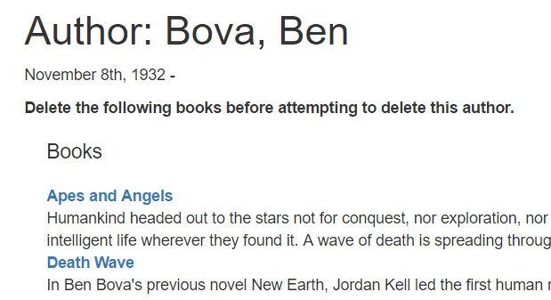

# Autor löschen Formular

Dieser Unterartikel zeigt, wie man eine Seite zum Löschen von Autorenobjekten definiert.

Wie im Abschnitt über die Gestaltung des Formulars erläutert, besteht unsere Strategie darin, nur das Löschen von Objekten zuzulassen, die nicht von anderen Objekten referenziert werden (in diesem Fall bedeutet das, dass wir nicht zulassen, dass ein Autor gelöscht wird, wenn er von einem Buch referenziert wird). In Bezug auf die Implementierung bedeutet dies, dass das Formular bestätigen muss, dass keine zugehörigen Bücher vorhanden sind, bevor der Autor gelöscht wird. Wenn es verknüpfte Bücher gibt, sollten diese angezeigt werden, und es sollte darauf hingewiesen werden, dass sie gelöscht werden müssen, bevor das Author-Objekt gelöscht werden kann.

## Controller—get route

Öffnen Sie /controllers/authorController.js. Suchen Sie die exportierte Controller-Methode author_delete_get() und ersetzen Sie sie durch den folgenden Code.

```javascript
// Display Author delete form on GET.
exports.author_delete_get = asyncHandler(async (req, res, next) => {
  // Get details of author and all their books (in parallel)
  const [author, allBooksByAuthor] = await Promise.all([
    Author.findById(req.params.id).exec(),
    Book.find({ author: req.params.id }, "title summary").exec(),
  ]);

  if (author === null) {
    // No results.
    res.redirect("/catalog/authors");
  }

  res.render("author_delete", {
    title: "Delete Author",
    author: author,
    author_books: allBooksByAuthor,
  });
});
```

Der Controller holt sich die ID der zu löschenden Autoreninstanz aus dem URL-Parameter (req.params.id). Er verwendet await auf das von Promise.all() zurückgegebene Versprechen, um asynchron auf den angegebenen Autorendatensatz und alle zugehörigen Bücher zu warten (parallel). Wenn beide Vorgänge abgeschlossen sind, wird die Ansicht author_delete.pug gerendert, wobei Variablen für Titel, Autor und author_books übergeben werden.

> Hinweis: Wenn findById() keine Ergebnisse liefert, befindet sich der Autor nicht in der Datenbank. In diesem Fall gibt es nichts zu löschen, so dass wir sofort zur Liste aller Autoren weiterleiten.
> ```javascript
> if (author === null) {
>   // No results.
>   res.redirect("/catalog/authors");
> }
> ```

## Controller—post route

Suchen Sie die exportierte Controllermethode author_delete_post() und ersetzen Sie sie durch den folgenden Code.

```javascript
// Handle Author delete on POST.
exports.author_delete_post = asyncHandler(async (req, res, next) => {
  // Get details of author and all their books (in parallel)
  const [author, allBooksByAuthor] = await Promise.all([
    Author.findById(req.params.id).exec(),
    Book.find({ author: req.params.id }, "title summary").exec(),
  ]);

  if (allBooksByAuthor.length > 0) {
    // Author has books. Render in same way as for GET route.
    res.render("author_delete", {
      title: "Delete Author",
      author: author,
      author_books: allBooksByAuthor,
    });
    return;
  } else {
    // Author has no books. Delete object and redirect to the list of authors.
    await Author.findByIdAndRemove(req.body.authorid);
    res.redirect("/catalog/authors");
  }
});
```

Zunächst wird überprüft, ob eine ID angegeben wurde (diese wird über die Parameter des Formularkörpers gesendet und nicht über die Version in der URL). Dann werden der Autor und die zugehörigen Bücher auf die gleiche Weise wie bei der GET-Route ermittelt. Wenn es keine Bücher gibt, löschen wir das Autorenobjekt und leiten zur Liste aller Autoren weiter. Wenn noch Bücher vorhanden sind, wird das Formular einfach erneut angezeigt, wobei der Autor und die Liste der zu löschenden Bücher übergeben werden.

> Hinweis: Wir könnten prüfen, ob der Aufruf von findById() ein Ergebnis liefert, und wenn nicht, sofort die Liste aller Autoren darstellen. Der Kürze halber haben wir den Code so belassen, wie er oben steht (er gibt immer noch die Liste der Autoren zurück, wenn die ID nicht gefunden wird, aber dies geschieht nach findByIdAndRemove()).

## Ansicht

Erstellen Sie /views/author_delete.pug und kopieren Sie den unten stehenden Text hinein.

```pug
extends layout

block content
  h1 #{title}: #{author.name}
  p= author.lifespan

  if author_books.length

    p #[strong Delete the following books before attempting to delete this author.]

    div(style='margin-left:20px;margin-top:20px')

      h4 Books

      dl
      each book in author_books
        dt
          a(href=book.url) #{book.title}
        dd #{book.summary}

  else
    p Do you really want to delete this Author?

    form(method='POST' action='')
      div.form-group
        input#authorid.form-control(type='hidden',name='authorid', required='true', value=author._id )

      button.btn.btn-primary(type='submit') Delete
```

Die Ansicht erweitert die Layout-Vorlage und überschreibt den Block "Inhalt". Oben zeigt sie die Autorendetails an. Sie enthält dann eine bedingte Anweisung auf der Grundlage der Anzahl der author_books (die if- und else-Klauseln).

Wenn es Bücher gibt, die mit dem Autor verbunden sind, listet die Seite die Bücher auf und sagt, dass diese gelöscht werden müssen, bevor der Autor gelöscht werden kann.
Wenn keine Bücher vorhanden sind, wird eine Sicherheitsabfrage angezeigt.
Wird die Schaltfläche "Löschen" angeklickt, wird die Kennung des Autors in einer POST-Anfrage an den Server gesendet, und der Datensatz dieses Autors wird gelöscht.

## Hinzufügen einer Löschkontrolle

Als Nächstes fügen wir der Detailansicht des Autors ein Steuerelement Löschen hinzu (die Detailseite ist ein guter Ort, um einen Datensatz zu löschen).

> Hinweis: In einer vollständigen Implementierung würde das Steuerelement nur für autorisierte Benutzer sichtbar sein. Zum jetzigen Zeitpunkt haben wir jedoch noch kein Autorisierungssystem eingerichtet!

Öffnen Sie die Ansicht author_detail.pug und fügen Sie die folgenden Zeilen am unteren Rand ein.

```pug
hr
p
  a(href=author.url+'/delete') Delete author
```

Das Steuerelement sollte nun als Link erscheinen, wie unten auf der Autorendetailseite gezeigt.


## Wie sieht es aus? 

Führen Sie die Anwendung aus und öffnen Sie Ihren Browser auf http://localhost:3000/. Wählen Sie dann den Link Alle Autoren und anschließend einen bestimmten Autor aus. Wählen Sie schließlich den Link Autor löschen.

Wenn der Autor keine Bücher hat, wird eine Seite wie diese angezeigt. Nachdem Sie auf "Löschen" geklickt haben, wird der Server den Autor löschen und zur Autorenliste zurückkehren.


Wenn der Autor Bücher hat, wird Ihnen eine Ansicht wie die folgende angezeigt. Sie können dann die Bücher von ihren Detailseiten löschen (sobald der Code implementiert ist!).



> Hinweis: Die anderen Seiten zum Löschen von Objekten können auf ähnliche Weise implementiert werden. Wir haben das als Herausforderung belassen.
