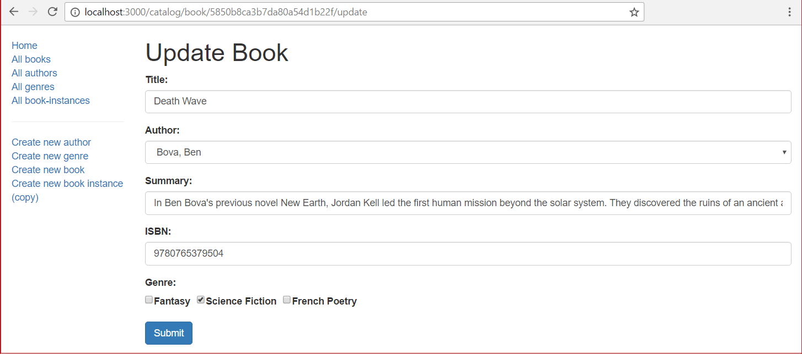

# Buch aktualisieren Formular

Dieser letzte Unterartikel zeigt, wie man eine Seite zur Aktualisierung von Buchobjekten definiert. Die Handhabung des Formulars bei der Aktualisierung eines Buches ist ähnlich wie bei der Erstellung eines Buches, mit dem Unterschied, dass Sie das Formular in der GET-Route mit Werten aus der Datenbank füllen müssen.

## Controller—get route

Öffnen Sie /controllers/bookController.js. Suchen Sie die exportierte Controller-Methode book_update_get() und ersetzen Sie sie durch den folgenden Code.

```javascript
// Display book update form on GET.
exports.book_update_get = asyncHandler(async (req, res, next) => {
  // Get book, authors and genres for form.
  const [book, allAuthors, allGenres] = await Promise.all([
    Book.findById(req.params.id).populate("author").populate("genre").exec(),
    Author.find().exec(),
    Genre.find().exec(),
  ]);

  if (book === null) {
    // No results.
    const err = new Error("Book not found");
    err.status = 404;
    return next(err);
  }

  // Mark our selected genres as checked.
  for (const genre of allGenres) {
    for (const book_g of book.genre) {
      if (genre._id.toString() === book_g._id.toString()) {
        genre.checked = "true";
      }
    }
  }

  res.render("book_form", {
    title: "Update Book",
    authors: allAuthors,
    genres: allGenres,
    book: book,
  });
});
```

Der Controller erhält die ID des zu aktualisierenden Buches aus dem URL-Parameter (req.params.id). Er wartet auf das Versprechen, das von Promise.all() zurückgegeben wird, um den angegebenen Buch-Datensatz (mit den Feldern "Genre" und "Autor") und alle Autor- und Genre-Datensätze zu erhalten.

Wenn die Operationen abgeschlossen sind, prüft die Funktion, ob Bücher gefunden wurden, und wenn nicht, sendet sie die Fehlermeldung "Buch nicht gefunden" an die Middleware für die Fehlerbehandlung.

> Hinweis: Kein Buch gefunden zu haben, ist kein Fehler für eine Suche - aber für diese Anwendung schon, denn wir wissen, dass es einen passenden Bucheintrag geben muss! Der obige Code vergleicht für (book===null) im Callback, aber er hätte genauso gut die Methode orFail() mit der Abfrage verketten können.

Anschließend markieren wir die aktuell ausgewählten Genres als geprüft und rendern dann die Ansicht book_form.pug, wobei wir Variablen für Titel, Buch, alle Autoren und alle Genres übergeben.

## Controller—post route

Suchen Sie die exportierte Controllermethode book_update_post() und ersetzen Sie sie durch den folgenden Code.

```javascript
// Handle book update on POST.
exports.book_update_post = [
  // Convert the genre to an array.
  (req, res, next) => {
    if (!(req.body.genre instanceof Array)) {
      if (typeof req.body.genre === "undefined") {
        req.body.genre = [];
      } else {
        req.body.genre = new Array(req.body.genre);
      }
    }
    next();
  },

  // Validate and sanitize fields.
  body("title", "Title must not be empty.")
    .trim()
    .isLength({ min: 1 })
    .escape(),
  body("author", "Author must not be empty.")
    .trim()
    .isLength({ min: 1 })
    .escape(),
  body("summary", "Summary must not be empty.")
    .trim()
    .isLength({ min: 1 })
    .escape(),
  body("isbn", "ISBN must not be empty").trim().isLength({ min: 1 }).escape(),
  body("genre.*").escape(),

  // Process request after validation and sanitization.
  asyncHandler(async (req, res, next) => {
    // Extract the validation errors from a request.
    const errors = validationResult(req);

    // Create a Book object with escaped/trimmed data and old id.
    const book = new Book({
      title: req.body.title,
      author: req.body.author,
      summary: req.body.summary,
      isbn: req.body.isbn,
      genre: typeof req.body.genre === "undefined" ? [] : req.body.genre,
      _id: req.params.id, // This is required, or a new ID will be assigned!
    });

    if (!errors.isEmpty()) {
      // There are errors. Render form again with sanitized values/error messages.

      // Get all authors and genres for form
      const [allAuthors, allGenres] = await Promise.all([
        Author.find().exec(),
        Genre.find().exec(),
      ]);

      // Mark our selected genres as checked.
      for (const genre of allGenres) {
        if (book.genre.indexOf(genre._id) > -1) {
          genre.checked = "true";
        }
      }
      res.render("book_form", {
        title: "Update Book",
        authors: allAuthors,
        genres: allGenres,
        book: book,
        errors: errors.array(),
      });
      return;
    } else {
      // Data from form is valid. Update the record.
      const thebook = await Book.findByIdAndUpdate(req.params.id, book, {});
      // Redirect to book detail page.
      res.redirect(thebook.url);
    }
  }),
];
```

Dies ist sehr ähnlich wie die Post-Route, die beim Erstellen eines Buches verwendet wird. Zuerst validieren und bereinigen wir die Buchdaten aus dem Formular und verwenden sie, um ein neues Book-Objekt zu erstellen (indem wir seinen _id-Wert auf die ID des zu aktualisierenden Objekts setzen). Wenn bei der Validierung der Daten Fehler auftreten, wird das Formular neu gerendert, wobei zusätzlich die vom Benutzer eingegebenen Daten, die Fehler und die Listen der Genres und Autoren angezeigt werden. Wenn keine Fehler auftreten, rufen wir Book.findByIdAndUpdate() auf, um das Book-Dokument zu aktualisieren, und leiten dann zu seiner Detailseite weiter.

## Ansicht

Es besteht keine Notwendigkeit, die Ansicht für das Formular (/views/book_form.pug) zu ändern, da dieselbe Vorlage sowohl für die Erstellung als auch für die Aktualisierung des Buches verwendet werden kann.

## Hinzufügen einer Aktualisierungsschaltfläche

Öffnen Sie die Ansicht book_detail.pug und vergewissern Sie sich, dass unten auf der Seite Links zum Löschen und Aktualisieren von Büchern vorhanden sind, wie unten dargestellt.

```pug
  hr
  p
    a(href=book.url+'/delete') Delete Book
  p
    a(href=book.url+'/update') Update Book
```

Sie sollten nun in der Lage sein, die Bücher auf der Buch-Detailseite zu aktualisieren.

## wie sieht es aus? 

Führen Sie die Anwendung aus, öffnen Sie Ihren Browser auf http://localhost:3000/, wählen Sie den Link Alle Bücher und dann ein bestimmtes Buch aus. Wählen Sie schließlich den Link Buch aktualisieren.

Das Formular sollte genauso aussehen wie die Seite "Buch erstellen", nur mit dem Titel "Buch aktualisieren" und mit vorausgefüllten Datensatzwerten.



> Hinweis: Die anderen Seiten zum Aktualisieren von Objekten können auf ähnliche Weise implementiert werden. Wir haben das als Herausforderung belassen.
