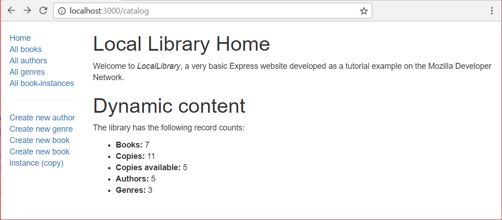
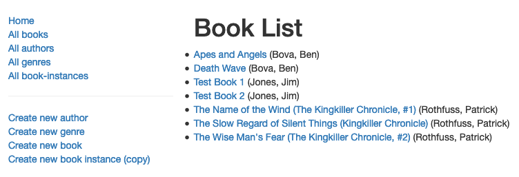
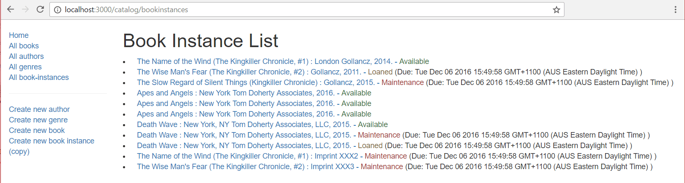

# Template für die Homepage

Die erste Seite, die wir erstellen werden, ist die Startseite der Website, die entweder von der Site (`/`) oder vom Katalog (`catalog/`) Root aus erreichbar ist. Sie wird einen statischen Text, der die Seite beschreibt, sowie dynamisch berechnete "Zählungen" verschiedener Datensatztypen in der Datenbank anzeigen.

Wir haben bereits eine Route für die Startseite erstellt. Um die Seite zu vervollständigen, müssen wir unsere Controller-Funktion aktualisieren, um "Zählungen" von Datensätzen aus der Datenbank zu holen, und eine Ansicht (Vorlage) erstellen, die wir zum Rendern der Seite verwenden können.

## Route

Wir haben unsere Indexseiten-Routen in einem [vorherigen Tutorial](/en-US/docs/Learn/Server-side/Express_Nodejs/routes) erstellt.
Zur Erinnerung, alle Routenfunktionen sind in **/routes/catalog.
js** definiert:

```js
// GET Katalog-Startseite.
router.get("/", book_controller.index); // Dies wird tatsächlich auf /catalog/ abgebildet, weil wir die Route mit einem /catalog-Präfix importieren.
```

Die Buch-Controller-Indexfunktion, die als Parameter (`book_controller.index`) übergeben wird, hat eine "Platzhalter"-Implementierung, die in **/controllers/bookController.js** definiert ist:

```js
exports.index = asyncHandler(async (req, res, next) => {
  res.send("NOT IMPLEMENTED: Site Home Page");
});
```

Es ist diese Controller-Funktion, die wir erweitern, um Informationen von unseren Modellen zu erhalten und sie dann mit einer Vorlage (Ansicht) zu rendern.

## Controller

Die Index-Controller-Funktion muss Informationen darüber abrufen, wie viele `Book`, `BookInstance` (alle), `BookInstance` (verfügbar), `Author` und `Genre` Datensätze wir in der Datenbank haben, diese Daten in einer Vorlage rendern, um eine HTML-Seite zu erstellen, und sie dann in einer HTTP-Antwort zurückgeben.

Öffnen Sie **/controllers/bookController.js**. In der Nähe der oberen Datei sollten Sie die exportierte `index()` Funktion sehen.

```js
const Book = require("../models/book");
const asyncHandler = require("express-async-handler");

exports.index = asyncHandler(async (req, res, next) => {
  res.send("NOT IMPLEMENTED: Site Home Page");
});
```

Ersetzen Sie den gesamten oben stehenden Code durch das folgende Codefragment.
Das erste, was dies tut, ist das Importieren (`require()`) aller Modelle.
Wir müssen dies tun, weil wir sie verwenden werden, um unsere Dokumentzählungen zu bekommen.


```js
const Book = require("../models/book");
const Author = require("../models/author");
const Genre = require("../models/genre");
const BookInstance = require("../models/bookinstance");

const asyncHandler = require("express-async-handler");

exports.index = asyncHandler(async (req, res, next) => {
  // Details von Büchern, Buchinstanzen, Autoren und Genre-Zählungen holen (parallel)
  const [
    numBooks,
    numBookInstances,
    numAvailableBookInstances,
    numAuthors,
    numGenres,
  ] = await Promise.all([
    Book.countDocuments({}).exec(),
    BookInstance.countDocuments({}).exec(),
    BookInstance.countDocuments({ status: "Available" }).exec(),
    Author.countDocuments({}).exec(),
    Genre.countDocuments({}).exec(),
  ]);

  res.render("index", {
    title: "Local Library Home",
    book_count: numBooks,
    book_instance_count: numBookInstances,
    book_instance_available_count: numAvailableBookInstances,
    author_count: numAuthors,
    genre_count: numGenres,
  });
});
```

Wir verwenden die [`countDocuments()`](<https://mongoosejs.com/docs/api/model.html#Model.countDocuments()>) Methode, um die Anzahl der Instanzen jedes Modells zu erhalten.
Diese Methode wird auf einem Modell aufgerufen, mit einem optionalen Satz von Bedingungen, gegen die abgeglichen werden soll, und gibt ein `Query` Objekt zurück.
Die Abfrage kann ausgeführt werden, indem man [`exec()`](https://mongoosejs.com/docs/api/query.html#Query.prototype.exec) aufruft, das ein `Promise` zurückgibt, das entweder mit einem Ergebnis erfüllt wird, oder abgelehnt wird, wenn es einen Datenbankfehler gibt.

Da die Abfragen für Dokumentzählungen voneinander unabhängig sind, verwenden wir [`Promise.all()`](/en-US/docs/Web/JavaScript/Reference/Global_Objects/Promise/all), um sie parallel auszuführen.
Die Methode gibt ein neues Versprechen zurück, das wir auf Fertigstellung [`await`](/en-US/docs/Web/JavaScript/Reference/Operators/await) (die Ausführung pausiert innerhalb _dieser Funktion_ bei `await`).
Wenn alle Abfragen abgeschlossen sind, erfüllt das von `all()` zurückgegebene Versprechen, setzt die Ausführung der Routen-Handler-Funktion fort und füllt das Array mit den Ergebnissen der Datenbankabfragen.

Wir rufen dann [`res.render()`](https://expressjs.com/en/4x/api.html#res.render) auf, geben eine Ansicht (Vorlage) namens '**index**' und Objekte an, die die Ergebnisse der Datenbankabfragen auf die Vorlagenvorlage abbilden.
Die Daten werden als Schlüssel-Wert-Paare geliefert und können in der Vorlage mit dem Schlüssel aufgerufen werden.

Beachten Sie, dass der Code sehr einfach ist, weil wir davon ausgehen können, dass die Datenbankabfragen erfolgreich sind.
Wenn eine der Datenbankoperationen fehlschlägt, wird die geworfene Ausnahme von `asyncHandler()` gefangen und an den nächsten Middleware-Handler in der Kette weitergegeben.

## Views

Öffnen Sie **/views/index.pug** und ersetzen Sie den Inhalt durch den

 unten stehenden Text.

```pug
extends layout

block content
  h1= title
  p Willkommen in der #[em LocalLibrary], einer sehr einfachen Express-Website, die als Tutorial-Beispiel im Mozilla Developer Network entwickelt wurde.

  h1 Dynamischer Inhalt

  p Die Bibliothek hat die folgenden Datensatzzählungen:

  ul
    li #[strong Bücher:] !{book_count}
    li #[strong Exemplare:] !{book_instance_count}
    li #[strong Verfügbare Exemplare:] !{book_instance_available_count}
    li #[strong Autoren:] !{author_count}
    li #[strong Genres:] !{genre_count}
```

Die Ansicht ist unkompliziert. Wir erweitern die **layout.pug** Basistemplate, überschreiben den `block` namens '**content**'. Die erste `h1` Überschrift wird der escaped Text für die `title` Variable sein, die in die `render()` Funktion eingegeben wurde - beachten Sie die Verwendung des '`h1=`', damit der folgende Text als JavaScript-Ausdruck behandelt wird. Dann fügen wir einen Absatz ein, der die LocalLibrary vorstellt.

Unter der Überschrift _Dynamischer Inhalt_ listen wir die Anzahl der Kopien jedes Modells auf.
Beachten Sie, dass die Vorlagenwerte für die Daten die Schlüssel sind, die angegeben wurden, als `render()` in der Routen-Handler-Funktion aufgerufen wurde.

## Wie sieht es aus?

Zu diesem Zeitpunkt sollten wir alles erstellt haben, was zur Anzeige der Indexseite benötigt wird. Starten Sie die Anwendung und öffnen Sie Ihren Browser auf `http://localhost:3000/`. Wenn alles richtig eingerichtet ist, sollte Ihre Seite etwa so aussehen wie im folgenden Screenshot.



> **Hinweis:** Sie können die Links in der Seitenleiste noch nicht _verwenden_, weil die URLs, Ansichten und Vorlagen für diese Seiten noch nicht definiert wurden. Wenn Sie es versuchen, erhalten Sie Fehler wie "NOT IMPLEMENTED: Book list" zum Beispiel, abhängig davon, auf welchen Link Sie klicken. Diese Zeichenkettenliterale (die durch richtige Daten ersetzt werden) wurden in den verschiedenen Controllern festgelegt, die in Ihrer "controllers" Datei leben.

## Book list Seite

Als nächstes implementieren wir unsere Buchliste. Diese Seite muss eine Liste aller Bücher in der Datenbank zusammen mit ihrem Autor anzeigen, wobei jeder Buchtitel ein Hyperlink zu seiner zugehörigen Buchdetailseite sein soll.

## Controller

Die Controller-Funktion für die Buchliste muss eine Liste aller `Book` Objekte in der Datenbank abrufen, sortieren und dann diese zur Darstellung an die Vorlage weitergeben.

Öffnen Sie **/controllers/bookController.js**. Finden Sie die exportierte `book_list()` Controller-Methode und ersetzen Sie sie durch den folgenden Code.

```js
// Liste aller Bücher anzeigen.
exports.book_list = asyncHandler(async (req, res, next) => {
  const allBooks = await Book.find({}, "title author")
    .sort({ title: 1 })
    .populate("author")
    .exec();

  res.render("book_list", { title: "Buchliste", book_list: allBooks });
});
```

Der Routen-Handler ruft die `find()` Funktion auf dem `Book` Modell auf, wobei nur der `title` und `author` zurückgegeben werden, da wir die anderen Felder nicht benötigen (es werden auch die `_id` und virtuelle Felder zurückgegeben), und sortiert die Ergebnisse alphabetisch nach dem Titel mit der `sort()` Methode.
Wir rufen auch `populate()` auf `Book` auf und geben das `author` Feld an - dies wird die gespeicherte Buchautor-ID durch die vollständigen Autorendetails ersetzen.
`exec()` wird dann am Ende verketten, um die Abfrage auszuführen und ein Versprechen zurückzugeben.

Der Routen-Handler verwendet `await`, um auf das Versprechen zu warten und die Ausführung zu pausieren, bis es erfüllt ist.
Wenn das Versprechen erfüllt ist, werden die Ergebnisse der Abfrage in der `allBooks` Variable gespeichert und der Handler setzt die Ausführung fort.

Der letzte Teil des Routen-Handlers ruft `render()` auf, gibt das **book_list** (.pug) Template an und übergibt Werte für den `title` und die `book_list` an die Vorlage.

## Ansicht

Erstellen Sie **/views/book_list.pug** und kopieren Sie den unten stehenden Text hinein.

```pug
extends layout

block content
  h1= title

  ul
    each book in book_list
      li
        a(href=book.url) #{book.title}
        |  (#{book.author.name})

    else
      li Es gibt keine Bücher.
```

Die Ansicht erweitert die **layout.pug** Basistemplate und überschreibt den `block` namens '**content**'. Sie zeigt den `title` an, den wir vom Controller über die `render()` Methode weitergegeben haben, und iteriert mit der `each`-`in`-`else` Syntax durch die `book_list` Variable. Für jedes Buch wird ein Listenelement erstellt, das den Buchtitel als Link zur Buchdetailseite anzeigt, gefolgt vom Namen des Autors.
Wenn in der `book_list` keine Bücher vorhanden sind, wird die `else` Klausel ausgeführt und der Text 'Es gibt keine Bücher' angezeigt.

> **Hinweis:** Wir verwenden `book.url`, um den Link zum Detaildatensatz für jedes Buch bereitz

ustellen (wir haben diese Route implementiert, aber die Seite noch nicht). Dies ist eine virtuelle Eigenschaft des `Book` Modells, die das `_id` Feld der Modellinstanz verwendet, um einen eindeutigen URL-Pfad zu erzeugen.

Interessant hier ist, dass jedes Buch als zwei Zeilen definiert ist, wobei das Pipe für die zweite Zeile verwendet wird. Dieser Ansatz ist notwendig, weil wenn der Autorenname auf der vorherigen Zeile wäre, würde er Teil des Hyperlinks sein.

## Wie sieht es aus?

Starten Sie die Anwendung (siehe [Testing the routes](/de-DE/docs/Learn/Server-side/Express_Nodejs/routes#testing_the_routes) für die entsprechenden Befehle) und öffnen Sie Ihren Browser unter `http://localhost:3000/`. Wählen Sie dann den Link _Alle Bücher_. Wenn alles richtig eingerichtet ist, sollte Ihre Seite etwa so aussehen wie im folgenden Screenshot.




## BookInstance list page

Als nächstes implementieren wir unsere Liste aller Buchexemplare (`BookInstance`) in der Bibliothek. Diese Seite muss den Titel des `Book`, das mit jedem `BookInstance` verknüpft ist (verlinkt mit seiner Detailseite), zusammen mit anderen Informationen im `BookInstance` Modell, einschließlich des Status, des Drucks und der eindeutigen ID jedes Exemplars enthalten. Der Text der eindeutigen ID sollte mit der Detailseite des `BookInstance` verlinkt sein.

## Controller

Die Controller-Funktion für die `BookInstance` Liste muss eine Liste aller Buchinstanzen abrufen, die zugehörigen Buchinformationen laden und dann die Liste zur Darstellung an die Vorlage weitergeben.

Öffnen Sie `/controllers/bookinstanceController.js`.
Finden Sie die exportierte `bookinstance_list()` Controller-Methode und ersetzen Sie sie durch den folgenden Code.

```js
// Anzeige der Liste aller BookInstances.
exports.bookinstance_list = asyncHandler(async (req, res, next) => {
  const allBookInstances = await BookInstance.find().populate("book").exec();

  res.render("bookinstance_list", {
    title: "Liste der Buchinstanzen",
    bookinstance_list: allBookInstances,
  });
});
```

Der Routenhandler ruft die `find()` Funktion auf dem `BookInstance` Modell auf und verketten dann einen Aufruf an `populate()` mit dem `book` Feld - dies wird die für jede `BookInstance` gespeicherte Buch-ID durch ein vollständiges `Book` Dokument ersetzen.
`exec()` wird dann am Ende verketten, um die Abfrage auszuführen und ein Versprechen zurückzugeben.

Der Routenhandler verwendet `await`, um auf das Versprechen zu warten und die Ausführung zu pausieren, bis es erfüllt ist.
Wenn das Versprechen erfüllt ist, werden die Ergebnisse der Abfrage in der `allBookInstances` Variable gespeichert und der Routenhandler setzt die Ausführung fort.

Der letzte Teil des Codes ruft `render()` auf, gibt das **bookinstance_list** (.pug) Template an und übergibt Werte für den `title` und die `bookinstance_list` an die Vorlage.

## Ansicht

Erstellen Sie **/views/bookinstance_list.pug** und kopieren Sie den unten stehenden Text hinein.

```pug
extends layout

block content
  h1= title

  ul
    each val in bookinstance_list
      li
        a(href=val.url) #{val.book.title} : #{val.imprint} -
        if val.status=='Available'
          span.text-success #{val.status}
        else if val.status=='Maintenance'
          span.text-danger #{val.status}
        else
          span.text-warning #{val.status}
        if val.status!='Available'
          span  (Fällig: #{val.due_back} )

    else
      li Es gibt keine Buchexemplare in dieser Bibliothek.
```

Diese Ansicht ist größtenteils die gleiche wie alle anderen. Sie erweitert das Layout, ersetzt den _content_ Block, zeigt den `title` an, der vom Controller übergeben wurde, und iteriert durch alle Buchexemplare in `bookinstance_list`. Für jede Kopie zeigen wir ihren Status (farbkodiert) an und wenn das Buch nicht verfügbar ist, sein voraussichtliches Rückgab

edatum. Eine neue Funktion wird eingeführt - wir können die Punkt-Notation nach einem Tag verwenden, um eine Klasse zuzuweisen. So wird `span.text-success` zu `<span class="text-success">` kompiliert (und könnte in Pug auch als `span(class="text-success")` geschrieben werden).

## Wie sieht es aus?

Starten Sie die Anwendung, öffnen Sie Ihren Browser unter `http://localhost:3000/` und wählen Sie dann den Link _Alle Buch-Instanzen_. Wenn alles richtig eingerichtet ist, sollte Ihre Seite etwa so aussehen wie im folgenden Screenshot.

