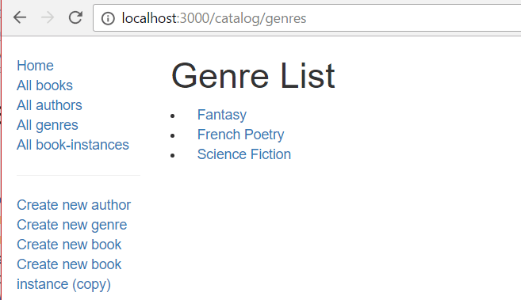
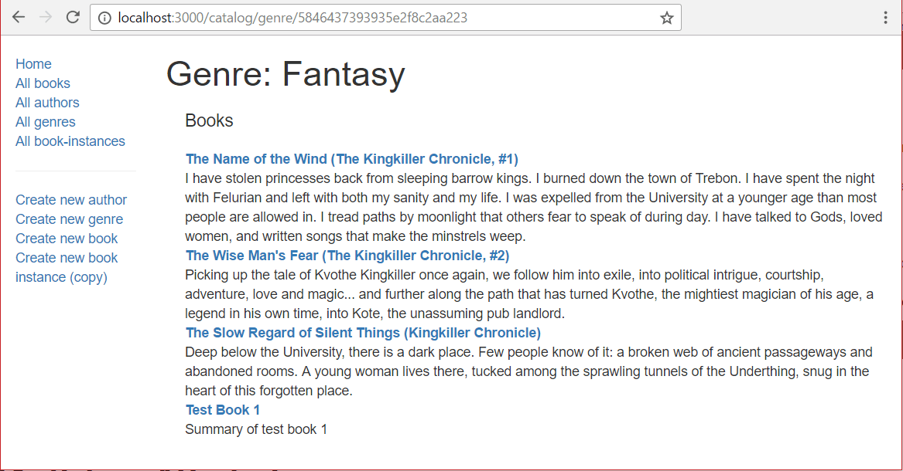

# Author list page and Genre list page challenge

Die Autorenliste muss eine Liste aller Autoren in der Datenbank anzeigen, wobei jeder Autorenname mit seiner zugehörigen Autorendetailseite verlinkt ist. Das Geburts- und Todesdatum sollte nach dem Namen in derselben Zeile aufgeführt werden.

## Controller

Die Controller-Funktion für die Autorenliste muss eine Liste aller `Author` Instanzen abrufen und diese dann zur Darstellung an die Vorlage weitergeben.

Öffnen Sie **/controllers/authorController.js**. Finden Sie die exportierte `author_list()` Controller-Methode nahe dem Anfang der Datei und ersetzen Sie sie durch den folgenden Code.

```js
// Anzeige der Liste aller Autoren.
exports.author_list = asyncHandler(async (req, res, next) => {
  const allAuthors = await Author.find().sort({ family_name: 1 }).exec();
  res.render("author_list", {
    title: "Autorenliste",
    author_list: allAuthors,
  });
});
```

Die Controller-Funktion für die Route folgt dem gleichen Muster wie für die anderen Listen-Seiten.
Es definiert eine Abfrage auf dem `Author` Modell, verwendet die `find()` Funktion, um alle Autoren zu bekommen, und die `sort()` Methode, um sie in alphabetischer Reihenfolge nach `family_name` zu sortieren.
`exec()` wird am Ende verketten, um die Abfrage auszuführen und ein Versprechen zurückzugeben, auf das die Funktion `await` kann.

Sobald das Versprechen erfüllt ist, rendert der Routenhandler die **author_list**(.pug) Vorlage, und gibt den Seitentitel und die Liste der Autoren (`allAuthors`) mit Vorlagenschlüsseln weiter.

## Ansicht

Erstellen Sie **/views/author_list.pug** und ersetzen Sie den Inhalt durch den untenstehenden Text.

```pug
extends layout

block content
  h1= title

  ul
    each author in author_list
      li
        a(href=author.url) #{author.name}
        |  (#{author.date_of_birth} - #{author.date_of_death})

    else
      li Es gibt keine Autoren.
```

Starten Sie die Anwendung und öffnen Sie Ihren Browser unter `http://localhost:3000/`. Dann wählen Sie den Link _Alle Autoren_. Wenn alles richtig eingerichtet ist, sollte die Seite etwa so aussehen wie im folgenden Screenshot.


> **Hinweis:** Das Aussehen der Autoren _Lebensdaten_ ist hässlich! Sie können dies verbessern, indem Sie den [gleichen Ansatz](/en-US/docs/Learn/Server-side/Express_Nodejs/Displaying_data/Date_formatting_using_moment) verwenden, den wir für die `BookInstance` Liste verwendet haben (Hinzufügen der virtuellen Eigenschaft für die Lebensdauer zum `Author` Modell).
>
> Da der Autor jedoch möglicherweise nicht tot ist oder fehlende Geburts-/Todesdaten hat, müssen wir in diesem Fall fehlende Daten oder Verweise auf nicht vorhandene Eigenschaften ignorieren. Eine Möglichkeit, damit umzugehen, besteht darin, je nachdem, ob die Eigenschaft definiert ist, entweder ein formatiertes Datum oder einen leeren String zurückzugeben

. Zum Beispiel:
>
> `return this.date_of_birth ? DateTime.fromJSDate(this.date_of_birth).toLocaleString(DateTime.DATE_MED) : '';`

## Genrelseite - Herausforderung!

In diesem Abschnitt sollten Sie Ihre eigene Genrelseite implementieren. Die Seite sollte eine Liste aller Genres in der Datenbank anzeigen, wobei jedes Genre mit seiner zugehörigen Detailseite verlinkt ist. Ein Screenshot des erwarteten Ergebnisses ist unten abgebildet.



Die Controller-Funktion für die Genreliste muss eine Liste aller `Genre` Instanzen abrufen und diese dann zur Darstellung an die Vorlage weitergeben.

1. Sie müssen `genre_list()` in **/controllers/genreController.js** bearbeiten.
2. Die Implementierung ist fast genau dieselbe wie die `author_list()` Controller.

   - Sortieren Sie die Ergebnisse nach Namen, in aufsteigender Reihenfolge.

3. Die zu rendernde Vorlage sollte **genre_list.pug** heißen.
4. Der zu rendernden Vorlage sollten die Variablen `title` ('Genre Liste') und `genre_list` (die Liste der Genres, die von Ihrer `Genre.find()` Callback-Funktion zurückgegeben werden) übergeben werden.
5. Die Ansicht sollte dem obigen Screenshot/den Anforderungen entsprechen (diese sollte eine sehr ähnliche Struktur/Formatierung wie die Autorenlistenansicht haben, mit der Ausnahme, dass Genres keine Daten haben).


### Genre Details 

Die Genre-_Detail_-Seite muss die Informationen für eine bestimmte Genre-Instanz anzeigen, wobei ihr automatisch generierter `_id` Feldwert als Kennung verwendet wird.
Die ID des benötigten Genre-Datensatzes ist am Ende der URL codiert und wird automatisch auf Basis der Routendefinition (**/genre/:id**) extrahiert.
Dann wird sie im Controller über die Anforderungsparameter: `req.params.id` aufgerufen.

Die Seite sollte den Genrenamen und eine Liste aller Bücher im Genre mit Links zu jeder Buchdetailseite anzeigen.

## Controller

Öffnen Sie **/controllers/genreController.js** und fordern Sie das `Book` Modul am Anfang der Datei an (die Datei sollte bereits das `Genre` Modul und "express-async-handler" `require()`).

```js
const Book = require("../models/book");
```

Finden Sie die exportierte `genre_detail()` Controller-Methode und ersetzen Sie sie durch den folgenden Code.

```js
// Detailseite für ein bestimmtes Genre anzeigen.
exports.genre_detail = asyncHandler(async (req, res, next) => {
  // Details des Genres und aller zugehörigen Bücher (parallel) abrufen
  const [genre, booksInGenre] = await Promise.all([
    Genre.findById(req.params.id).exec(),
    Book.find({ genre: req.params.id }, "title summary").exec(),
  ]);
  if (genre === null) {
    // Keine Ergebnisse.
    const err = new Error("Genre nicht gefunden");
    err.status = 404;
    return next(err);
  }

  res.render("genre_detail", {
    title: "Genre Detail",
    genre: genre,
    genre_books: booksInGenre,
  });
});
```

Wir verwenden zuerst `Genre.findById()`, um Genre-Informationen für eine bestimmte ID zu erhalten, und `Book.find()`, um alle Buchdatensätze zu bekommen, die diese zugehörige Genre-ID haben.
Da die beiden Anfragen nicht voneinander abhängen, verwenden wir `Promise.all()`, um die Datenbankabfragen parallel auszuführen (dieser Ansatz für parallele Abfragen wurde in der [Startseite](/en-US/docs/Learn/Server-side/Express_Nodejs/Displaying_data/Home_page#controller) demonstriert).

Wir `await` auf das zurückgegebene Versprechen, und sobald es sich erfüllt hat, überprüfen wir die Ergebnisse.
Wenn das Genre nicht in der Datenbank existiert (d.h., es könnte gelöscht worden sein), dann wird `findById()` erfolgreich ohne Ergebnisse zurückkehren.
In diesem Fall wollen wir eine "nicht gefunden" Seite anzeigen, also erstellen wir ein `Error` Objekt und geben es an die `next` Middleware-Funktion in der Kette weiter.

> **Hinweis:** Fehler, die an die `next` Middleware-Funktion übergeben werden, werden zu unserem Fehlerbehandlungscode weitergeleitet (dies wurde eingerichtet, als wir das [App-Skelett generiert haben](/en-US/docs/Learn/Server-side/Express_Nodejs/skeleton_website#app.js) - für mehr Informationen siehe [Fehlerbehandlung](/en-US/docs/Learn/Server-side/Express_Nodejs/Introduction#handling_errors)).

Wenn das `Genre` gefunden wird, dann rufen wir `render()` auf, um die Ansicht anzuzeigen.
Die Ansichtsvorlage ist **genre

_detail** (.pug).
Die Werte für den Titel, `genre` und `booksInGenre` werden mit den entsprechenden Schlüsseln (`title`, `genre` und `genre_books`) in die Vorlage eingegeben.

## Ansicht

Erstellen Sie **/views/genre_detail.pug** und füllen Sie es mit dem folgenden Text:

```pug
extends layout

block content

  h1 Genre: #{genre.name}

  div(style='margin-left:20px;margin-top:20px')

    h4 Bücher

    dl
      each book in genre_books
        dt
          a(href=book.url) #{book.title}
        dd #{book.summary}

      else
        p Dieses Genre hat keine Bücher
```

Die Ansicht ist sehr ähnlich zu all unseren anderen Vorlagen. Der Hauptunterschied besteht darin, dass wir den übergebenen `title` nicht für die erste Überschrift verwenden (obwohl er in der zugrunde liegenden **layout.pug** Vorlage zur Festlegung des Seitentitels verwendet wird).

## Wie sieht es aus?

Starten Sie die Anwendung und öffnen Sie Ihren Browser auf `http://localhost:3000/`. Wählen Sie den Link _Alle Genres_, dann wählen Sie eines der Genres (z.B. "Fantasy"). Wenn alles korrekt eingerichtet ist, sollte Ihre Seite ungefähr wie der folgende Screenshot aussehen.



> **Hinweis:** Sie könnten einen Fehler ähnlich wie diesen erhalten:
>
> ```bash
> Cast to ObjectId failed for value " 59347139895ea23f9430ecbb" at path "_id" for model "Genre"
> ```
>
> Dies ist ein Mongoose-Fehler, der von der `req.params.id` kommt. Um dieses Problem zu lösen, müssen Sie zuerst mongoose auf der `genreController.js` Seite wie folgt einbinden:
>
> ```js
> const mongoose = require("mongoose");
> ```
>
> Dann verwenden Sie `mongoose.Types.ObjectId()`, um die ID in einen Typ zu konvertieren, der verwendet werden kann. Zum Beispiel:
>
> ```js
> exports.genre_detail = asyncHandler(async (req, res, next) => {
>   const id = mongoose.Types.ObjectId(req.params.id);
>   // …
> });
> ```